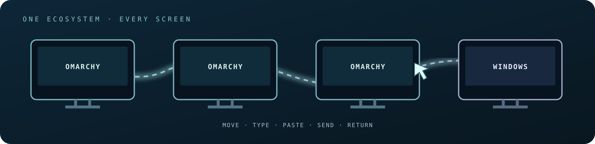
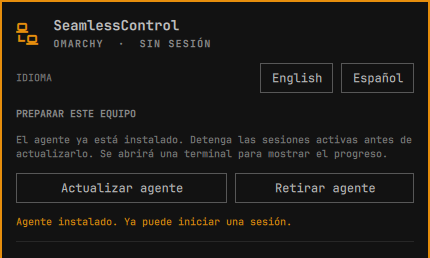
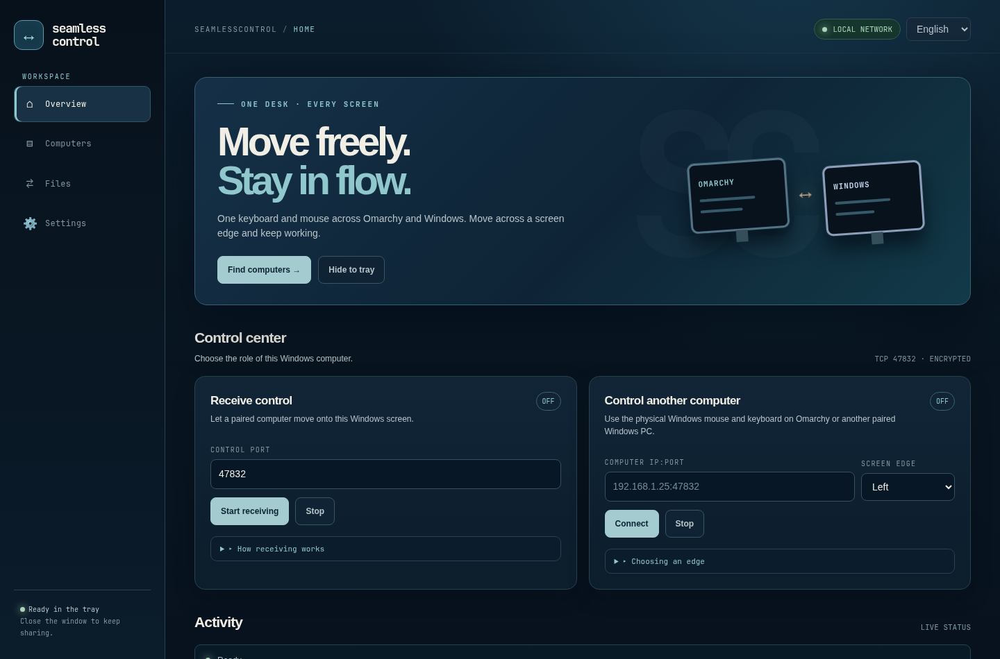
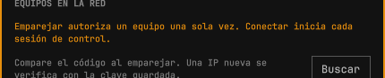

# SeamlessControl

[](https://github.com/PuroDelphi/seamlesscontrol/actions/workflows/validate.yml) · [Versión Omarchy](https://github.com/PuroDelphi/seamlesscontrol/releases/latest) · [Descargar Windows x64](https://github.com/PuroDelphi/seamlesscontrol/actions/workflows/windows-alpha.yml?query=branch%3Aalpha) · [MIT](LICENSE) · [English](README.md)

**Un ratón. Un teclado. Todas tus pantallas al alcance.** Cruza el borde para trabajar en el siguiente equipo y vuelve cruzando en sentido contrario o pulsando **Escape**. SeamlessControl une Omarchy y Windows en tu red privada con el mismo protocolo de emparejamiento y control.




- **Muévete con naturalidad:** el puntero, los clics, la rueda y el teclado te siguen. Los atajos con Windows/Super funcionan en el destino.
- **Mantén el ritmo:** sincronización del portapapeles de texto, regreso por el borde o con Escape y recuperación de la entrada local si termina la conexión.
- **Encuentra equipos cercanos:** el descubrimiento LAN muestra receptores disponibles. Puedes introducir `IP:puerto` si la red bloquea el descubrimiento.
- **Empareja con seguridad:** compara el código de seis cifras en ambos equipos. Cada uno recuerda la identidad del otro y exige revisar cualquier cambio de clave.
- **Envía archivos con aprobación:** el receptor autoriza cada oferta y verifica el archivo antes de guardarlo. La recepción utiliza un puerto independiente.
- **Usa una interfaz familiar:** panel Omarchy y aplicación Windows que permanece en la bandeja. Ambas tienen inglés y español.

Seguiremos mejorando SeamlessControl continuamente. La [guía técnica](docs/TECHNICAL.es.md) explica la arquitectura, los permisos y las verificaciones.

## Empezar en Omarchy

Instala el plugin en cada equipo Omarchy con el comando estándar:

```bash
omarchy plugin add https://github.com/PuroDelphi/seamlesscontrol.git --enable
```

Abre **SeamlessControl** desde la barra de Omarchy. En **Preparar este equipo**, pulsa **Instalar agente**. El panel instala los paquetes necesarios y el agente; solicitará autorización del sistema cuando corresponda. Empieza en inglés; puedes escoger **Español** arriba.



## Empezar en Windows x64

Descarga el último artefacto exitoso **Windows x64 alpha** en [Compilaciones Windows](https://github.com/PuroDelphi/seamlesscontrol/actions/workflows/windows-alpha.yml?query=branch%3Aalpha). Extrae **juntos** `seamlesscontrol.exe` y `seamlesscontrold.exe` en una carpeta. Haz doble clic en **`seamlesscontrol.exe`**. Comienza a recibir en el puerto `47832`, anuncia este Windows en la red local y sigue activo al cerrar la ventana; vuelve a abrirlo desde el icono de la bandeja. Puedes escoger **Español** arriba a la derecha.



Windows 11 normalmente incluye WebView2. Si la aplicación indica que falta, instala [Microsoft Edge WebView2 Runtime](https://developer.microsoft.com/en-us/microsoft-edge/webview2/) y ábrela de nuevo. Si Windows pregunta por el acceso a la red, permite solamente **Redes privadas**. En **Ajustes → Firewall de Windows**, la app puede pedir autorización de administrador para reglas LAN privadas del puerto de control, el de archivos y el autodescubrimiento mDNS (`UDP 5353`). Los botones TCP toman los puertos que ves en la interfaz.

[Guía Windows paso a paso](docs/WINDOWS-ALPHA.es.md) · [Guía ilustrada Omarchy](docs/USER-GUIDE.es.md)

## Conectar tus pantallas

1. En el equipo que quieres controlar, pulsa **Recibir control** y espera a **Disponible**. La app Windows lo inicia automáticamente.
2. En el equipo con el ratón físico, abre **Equipos**, elige el receptor descubierto y pulsa **Emparejar**. Compara el código de seis cifras y aprueba en **ambos** equipos. Si no aparece, escribe manualmente su `IP:puerto` de la red privada.
3. En **Equipos → Mapa de pantallas**, coloca el receptor emparejado en el lado donde está su pantalla. Omarchy y Windows tienen un mapa visual. En Windows, selecciona el equipo y haz clic en un lado, arrástralo o usa las flechas. Su posición rellena el borde al preparar **Conectar**.
4. Pulsa **Conectar** en el equipo con el ratón físico. Cuando indique **Listo**, cruza el **borde exterior** elegido. Regresa por el borde del receptor o pulsa **Escape** en el teclado físico.

**Emparejar** guarda la confianza una vez; **Conectar** inicia cada sesión. Mover una ficha del mapa solo define el lado de cruce. Para enviar archivos, abre **Archivos** en el receptor, autoriza si hace falta su puerto LAN independiente `47833`, pulsa **Esperar un archivo** y después elige y envía el archivo desde el origen. El receptor aprueba la oferta.



## Actualizar y desinstalar

**Omarchy:** termina las sesiones y actualiza el plugin en cada equipo Omarchy:

```bash
omarchy plugin update seamlesscontrol.control
```

Ejecuta `omarchy restart shell`, abre de nuevo SeamlessControl y pulsa **Actualizar agente** en **Preparar este equipo**. Se conservan las claves y el mapa.

**Windows:** sal de SeamlessControl desde el menú de la bandeja, descarga la compilación Windows x64 más reciente, reemplaza **ambos** archivos `.exe` en su carpeta y abre `seamlesscontrol.exe` otra vez. Se conservan las claves en `%LOCALAPPDATA%\SeamlessControl`.

Para retirarlo de Omarchy, pulsa **Retirar agente** en el panel y después:

```bash
omarchy plugin remove seamlesscontrol.control
```

En Windows, escoge **Exit SeamlessControl** en la bandeja y borra la carpeta con los dos ejecutables. `%LOCALAPPDATA%\SeamlessControl` se conserva para mantener la identidad y los emparejamientos tras una actualización; bórrala también solo si deseas crear una identidad nueva. Puedes quitar las reglas en Firewall de Windows por sus nombres `SeamlessControl TCP … Private LAN`.

## Documentación y comunidad

[Guía Omarchy](docs/USER-GUIDE.es.md) · [Guía Windows](docs/WINDOWS-ALPHA.es.md) · [Guía técnica](docs/TECHNICAL.es.md) · [Registro de verificación](docs/TEST-RESULTS.es.md) · [Ayuda](SUPPORT.es.md) · [Contribuir](CONTRIBUTING.es.md) · [Normas de conducta](CODE_OF_CONDUCT.es.md) · [Seguridad](SECURITY.es.md) · [Novedades](CHANGELOG.es.md)

Powered by JhonnySuarez - PuroDelphi. Si SeamlessControl te resulta útil, apoya su desarrollo continuo mediante [GitHub Sponsors](https://github.com/sponsors/PuroDelphi) o [PayPal](https://www.paypal.com/donate/?hosted_button_id=KBAUBYYDNHQNQ).

[](https://www.paypal.com/donate/?hosted_button_id=KBAUBYYDNHQNQ)
