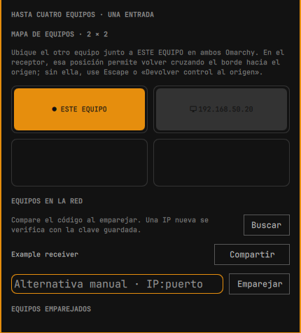

# SeamlessControl para Omarchy

Usa un ratón y teclado entre equipos Omarchy cercanos. Cruza el borde de una pantalla para controlar el siguiente equipo y vuelve por el borde para regresar. La primera versión se centra en Omarchy con Omarchy; la compatibilidad con Windows está prevista para después.

**Idioma:** [English](README.md) · Español
**Para desarrolladores:** [Guía técnica](docs/TECHNICAL.es.md) · [Resultados de pruebas](docs/TEST-RESULTS.es.md) · [Plan](PLAN.md)

> SeamlessControl es experimental. Dos equipos Omarchy físicos completaron dos recorridos de ida y vuelta con el ratón y una devolución con Escape. Faltan pruebas físicas de otras disposiciones y funciones.

Las capturas del panel usan nombres de equipo y direcciones de red ficticios.

## Instalar en ambos equipos

Usa el comando estándar de Omarchy:

```bash
omarchy plugin add https://github.com/PuroDelphi/seamlesscontrol.git --enable
```

Abre **SeamlessControl** desde la barra de Omarchy. El panel comienza en inglés; pulsa **Español** arriba para cambiar el idioma. En **Preparar este equipo**, pulsa **Instalar agente**. Se abrirá una terminal de Omarchy: instalará los paquetes que falten, compilará el agente y pedirá autorización si es necesaria. Vuelve al panel cuando la terminal indique que terminó. Repite en el segundo equipo.


La captura muestra un agente ya instalado, por eso el botón dice **Actualizar agente**. En un equipo nuevo, dice **Instalar agente**.

La primera compilación descarga dependencias de Rust y puede tardar. El panel detecta automáticamente el agente. El widget instalado por sí solo todavía no puede compartir la entrada.

## Actualizar en ambos equipos

Detén cualquier sesión activa de SeamlessControl. En **cada** Omarchy, actualiza el widget con el comando estándar:

```bash
omarchy plugin update seamlesscontrol.control
```

Abre el panel y pulsa **Actualizar agente** en **Preparar este equipo**. La terminal recompilará y reemplazará el agente sin borrar las claves de emparejamiento ni el mapa de equipos. Cierra la terminal cuando termine y vuelve a iniciar la recepción o el uso compartido. Actualiza ambos equipos antes de usar una versión nueva del agente. Un cambio de idioma del widget no requiere actualizarlo.

## Conectar dos equipos Omarchy

1. En el equipo **que vas a controlar**, pulsa **Recibir control**. Deja la dirección vacía para usar la IP de la red local y el puerto TCP `47832`.
2. En el equipo con el ratón físico, busca el receptor en **Equipos en la red** y pulsa **Emparejar**. Si no aparece, pulsa **Buscar** o escribe su `IP:puerto` en el campo manual.
3. **Ambos paneles** muestran un código de seis cifras. Compáralos y pulsa **Coincide · aprobar aquí** en **los dos equipos**. El código se genera automáticamente; no se puede escribir ni cambiar. La **Identidad local**, más larga, es la huella del equipo, no el código. Si el receptor sigue en `serve listening`, la conexión no le llegó: revisa la red y el firewall.
4. En **Mapa de equipos**, coloca el otro equipo junto a **Este equipo** en **ambos equipos**, tal como están físicamente. Por ejemplo, si el receptor está a la derecha del equipo con ratón, colócalo a la derecha en el origen; en el receptor, coloca el origen a la izquierda. Así podrás regresar cruzando el borde izquierdo del receptor.
5. En el equipo con ratón, pulsa **Compartir** junto al receptor descubierto. Cruza el borde elegido. Para volver, cruza el borde hacia el origen o pulsa **Escape** en el teclado físico.



Si el puntero no vuelve, pulsa **Devolver control al origen** en el receptor. **Cortar entrada remota · emergencia** desconecta y pausa la recepción; después pulsa **Reanudar recepción**. Para detener una sesión iniciada desde el panel, pulsa **Terminar sesión iniciada desde el panel**.

## Si el emparejamiento agota el tiempo

El cambio de firewall se hace en el **receptor**. En **Firewall · solo en el receptor**, escribe el mismo puerto TCP de **Recibir control**, pulsa **Preparar regla LAN** y revisa la interfaz, subred y destino que se muestran. Pulsa **Autorizar esta regla** para aprobarla en Omarchy. La regla se limita a la red local detectada; el panel no la abre a Internet.


Si eliges otro puerto de recepción, úsalo también en la sección de firewall. La recepción de archivos usa `47833` de forma predeterminada y necesita su propia regla si el firewall la bloquea.

## Desinstalar

Detén cualquier sesión activa. En **Preparar este equipo**, pulsa **Retirar agente** y confirma. La terminal retirará el agente y solo los paquetes que SeamlessControl haya registrado como instalados por él. Conservará las claves de emparejamiento y la posición de los equipos para una posible reinstalación. Después retira el widget con el comando estándar de Omarchy:

```bash
omarchy plugin remove seamlesscontrol.control
```

Si autorizaste una regla de firewall, retírala **antes** de quitar el widget en el receptor: `bash ~/.config/omarchy/plugins/seamlesscontrol.control/packaging/firewall-lan.sh remove <PUERTO>`. El script pide confirmación y autorización del sistema.

## Más información

- [Guía técnica: comandos manuales, seguridad, servicios y pruebas](docs/TECHNICAL.es.md)
- [Límites actuales y resultados de pruebas físicas](docs/TEST-RESULTS.es.md)
- [Plan](PLAN.md)

Licencia MIT. Consulta [LICENSE](LICENSE).
