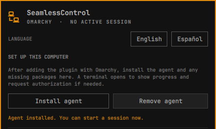
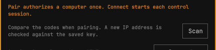
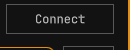
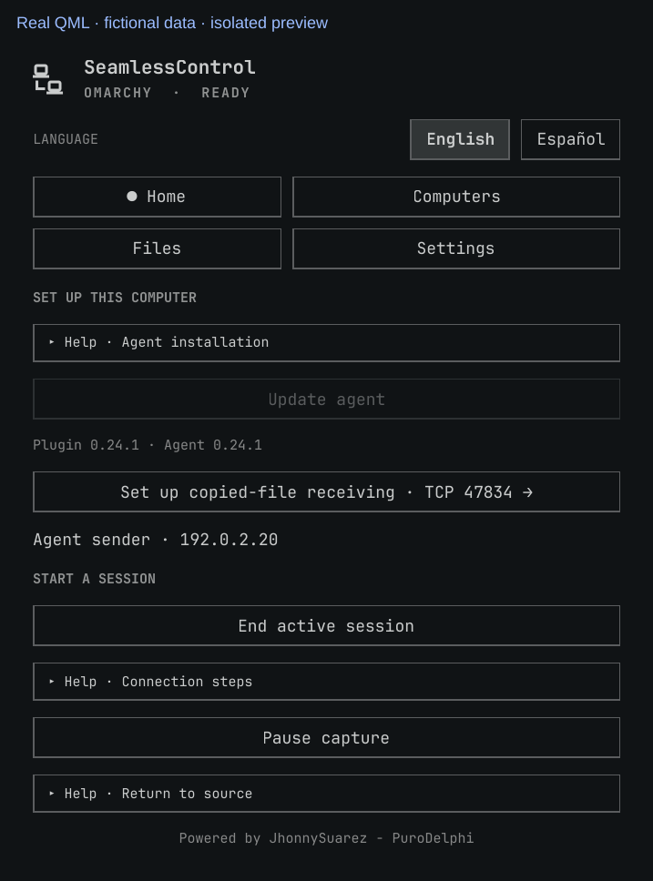
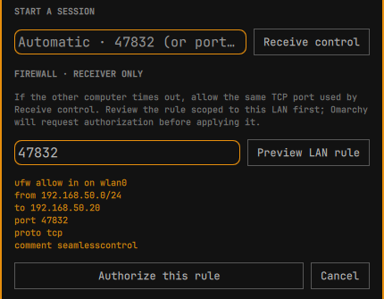

# SeamlessControl for Omarchy

[](https://github.com/PuroDelphi/seamlesscontrol/actions/workflows/validate.yml) · [Latest release](https://github.com/PuroDelphi/seamlesscontrol/releases/latest) · [MIT license](LICENSE)

Use one mouse and keyboard across nearby Omarchy computers. Move the pointer through a screen edge to control the next computer, then move back to return. The first release focuses on Omarchy to Omarchy; Windows support is planned later.

**Language:** English · [Español](README.es.md)

**Using the panel:** [Illustrated user guide](docs/USER-GUIDE.md)

**For developers:** [Technical guide](docs/TECHNICAL.md) · [Test results](docs/TEST-RESULTS.md) · [Roadmap (Spanish)](PLAN.md)

## Tested with two physical Omarchy computers

On one LAN, both computers paired with matching six digit codes. The mouse crossed to the receiver and returned across the opposite edge twice; pressing **Escape** also returned control. The physical **Super+V** shortcut opened clipboard history on the receiver. In a later `alpha` build, a text file was offered, accepted and delivered after the receiver authorized its separate file port.

These are observed results from one two-computer setup. [The test record](docs/TEST-RESULTS.md) lists the versions, local checks and scenarios still awaiting physical verification.

Panel screenshots use fictional computer names and network addresses.

## Install on both computers

Use the standard Omarchy plugin command:

```bash
omarchy plugin add https://github.com/PuroDelphi/seamlesscontrol.git --enable
```

Open **SeamlessControl** from the Omarchy bar. The panel starts in English; select **Español** at the top if you prefer Spanish. Under **Set up this computer**, select **Install agent**. An Omarchy terminal opens, installs any missing packages, builds the agent, and asks for authorization if needed. Return to the panel when the terminal says installation is complete. Repeat on the second computer.



The screenshot shows an existing installation, so this button reads **Update agent**. On a new computer, it reads **Install agent**.

The first build downloads Rust dependencies and can take a while. The setup installs missing `rust`, `avahi` and `wl-clipboard` packages and may request system authorization. The panel detects the agent automatically. The installed widget alone cannot share input until the agent is installed.

## Update on both computers

Stop any active SeamlessControl session. On **each** Omarchy, update the widget with the standard command:

```bash
omarchy plugin update seamlesscontrol.control
```

Then run `omarchy restart shell` and reopen the panel so Omarchy loads the updated interface. Choose **Update agent** under **Set up this computer**. The terminal rebuilds and replaces the agent while keeping pairing keys and the computer layout. Close the terminal when it finishes, then start receiving or connecting again. Update both computers before using a new agent version. If you only changed the widget's language, no update is needed.

## Connect two Omarchy computers

**Pair** trusts a computer once; **Connect** starts a control session each time you want to use it. Placing computers in the layout only chooses the crossing edge.

1. On the computer **to be controlled**, select **Receive control**. Leave the address blank to use the local network address and the default TCP port `47832`. Wait for **Available**.
2. On the computer with the physical mouse, find the receiver under **Computers on the network** and select **Pair**. If it does not appear, select **Scan** or enter its `IP:port` in the manual field.
3. **Both panels** show a six digit code. Compare them and select **Codes match · approve here** on **both computers**. The code is generated automatically; you cannot set or type it. The longer **Local identity** is the computer's fingerprint, not the pairing code. If the receiver still says **Available** and no code appears, check the network and firewall.
4. In **Computer layout**, place the other computer next to **This computer** on **both computers**, matching their physical positions. For example, if the receiver is to the right of the mouse computer, place it to the right on the source; place the source to the left on the receiver. This lets the pointer return by crossing the receiver's left edge. You can drag tiles or use Tab, Enter and the arrow keys. The layout only saves the crossing direction.
5. On the mouse computer, select **Connect** beside the discovered receiver. Wait for **Ready**, then move the pointer across the indicated **outer edge of all source monitors**. To return, cross the receiver edge toward the source or press **Escape** on the physical keyboard.







If the pointer does not return, choose **Return control to source** on the receiver. **Cut remote input · emergency** on the receiver disconnects and pauses receiving; choose **Resume receiving** afterward. Stop a session started from the panel with **Stop session started here**.

If the source stays at **Preparing mouse and keyboard capture** for 15 seconds, the panel offers **Restart capture on this computer**. It closes that attempt and restarts the desktop capture service; it may interrupt other screen-sharing apps. Select **Connect** again afterward. [The illustrated guide](docs/USER-GUIDE.md) shows the complete panel workflow, troubleshooting by status, file transfer and what the experimental multi-computer mesh does.

## If pairing times out

The firewall change belongs on the **receiver**. Under **Firewall · receiver only**, enter the same TCP port used by **Receive control**, select **Preview LAN rule**, and read the interface, subnet and destination shown. Select **Authorize this rule** to approve it in Omarchy. The rule is limited to the detected local network; the panel does not open it to the Internet.



If you choose a different receiver port, enter that port in the firewall section too. **Before the first file transfer**, enter the separate file port (`47833` by default) in the receiver's **Firewall · receiver only** section, then select **Preview LAN rule** and **Authorize this rule**. The control port (`47832` by default) does not open file transfers. Select **Wait for a file** again for each file.

## Remove

Stop any active session. In **Set up this computer**, choose **Remove agent** and confirm. The terminal removes the agent and only packages SeamlessControl itself recorded as newly installed. It preserves modified service files, pairing keys and computer positions so a later reinstall can reuse them. Then remove the widget with the standard Omarchy command:

```bash
omarchy plugin remove seamlesscontrol.control
```

If you authorized a firewall rule, remove it **before** removing the widget from the receiver: `bash ~/.config/omarchy/plugins/seamlesscontrol.control/packaging/firewall-lan.sh remove <PORT>`. The script asks for confirmation and system authorization.

## More

- [Help and troubleshooting](SUPPORT.md)
- [Contributing](CONTRIBUTING.md) · [Code of conduct](CODE_OF_CONDUCT.md) · [Security policy](SECURITY.md)
- [Release notes](CHANGELOG.md) · [Latest source release](https://github.com/PuroDelphi/seamlesscontrol/releases/latest)
- [Technical guide: manual commands, security, services and tests](docs/TECHNICAL.md)
- [Illustrated panel guide and feature reference](docs/USER-GUIDE.md)
- [Known limitations and physical test results](docs/TEST-RESULTS.md)
- [Roadmap (Spanish)](PLAN.md)
- [Publishing and exact marketplace SHA](docs/PUBLISHING.md)

MIT licensed. See [LICENSE](LICENSE).

## Support this project

If SeamlessControl helps you, you can support its maintenance through [GitHub Sponsors](https://github.com/sponsors/PuroDelphi) or [PayPal](https://www.paypal.com/donate/?hosted_button_id=KBAUBYYDNHQNQ). Donations are optional and do not change the MIT license.

[](https://www.paypal.com/donate/?hosted_button_id=KBAUBYYDNHQNQ)
