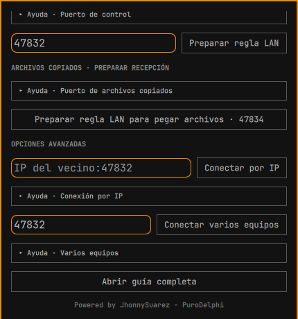

# Guía de uso de SeamlessControl

[Volver al README](../README.es.md) · [English](USER-GUIDE.md)

Esta guía muestra el panel Omarchy con dos equipos Omarchy: el **origen** tiene el ratón y teclado físicos, y el **receptor** acepta el control. SeamlessControl también conecta Omarchy con Windows; sigue la [guía Windows](WINDOWS.es.md) para esa combinación. Primero instala el plugin y el agente en ambos Omarchy. Las capturas usan nombres y direcciones ficticios.

El panel tiene cuatro secciones. **Inicio** muestra la instalación del agente, el estado del control y las acciones inmediatas de la sesión. **Equipos** reúne búsqueda, emparejamiento, pares de confianza y mapa de pantallas. **Archivos** contiene ofertas de archivos copiados, envíos manuales y límite de tamaño. **Ajustes** reúne la aprobación de archivos entrantes, las reglas del firewall receptor, la retirada del agente y las opciones avanzadas. Inicio tiene un acceso directo para preparar el puerto de archivos copiados. Una oferta de archivo que necesita aprobación también aparece arriba de cualquier sección con botones **Aceptar** y **Rechazar**; los códigos de emparejamiento y las ofertas manuales abren automáticamente su sección.

Después de actualizar el plugin, reinicia el shell de Omarchy como indica el [README](../README.es.md#actualizar-y-desinstalar) y vuelve a abrir el panel. Si no aparece **Aprobación de archivos entrantes** en **Ajustes**, el shell todavía muestra una versión anterior del panel.

## Recorrido por el panel de Omarchy

Estas capturas de Omarchy ilustran los controles con nombres de equipos, direcciones, claves y carpetas ficticias. La pestaña **Equipos** actual los presenta en el orden numerado 1–4 descrito abajo. Las filas de **Ayuda** se despliegan con un clic o enfocándolas y pulsando Enter; empiezan plegadas.

### Inicio: preparar este equipo y recibir control

- **English / Español** cambia el idioma del panel. **Instalar agente** aparece después de añadir el plugin; **Actualizar agente** aparece cuando ya está instalado. El botón abre una terminal para instalar o actualizar el agente y los paquetes necesarios. Detén una sesión activa antes de actualizar.
- **Preparar recepción de archivos copiados · TCP 47834** abre la sección correspondiente del firewall en Ajustes. Se necesita en el equipo que recibirá archivos copiados en el explorador de otro equipo.
- **Automático · 47832 (u otro puerto)** es la dirección de **Recibir control**. Deja Automático para una red local normal; si eliges otro puerto, usa ese mismo en el receptor y en su regla de firewall. **Recibir control** pone este equipo a escuchar y lo anuncia para el descubrimiento.
- La línea de estado indica si el agente está disponible, listo, controlando, en pausa o reconectando. Según la sesión aparecen **Pausar/Reanudar captura**, **Devolver control al origen**, **Cortar entrada remota · emergencia / Reanudar recepción**, **Reiniciar captura de este equipo** y **Terminar sesión iniciada desde el panel**. Sus usos se explican [más abajo](#para-qué-sirve-cada-función).

### Equipos: descubrir, emparejar, ubicar y conectar

- **1 · Emparejar por dirección** inicia el emparejamiento si conoces la `IP:puerto` del receptor. Déjalo en **Recibir control** y compara el código de seis cifras en ambos equipos; apruébalo en las dos interfaces.
- **2 · Equipos cercanos** muestra receptores anunciados en la LAN. **Buscar** actualiza la lista. Pulsa **Emparejar** en un equipo nuevo si no conoces su IP. Los pasos 1 y 2 son alternativas en la misma pestaña.

- **3 · Equipos emparejados** muestra las claves de confianza guardadas. **Revocar** retira la confianza después de una confirmación; la conexión normal sigue bloqueada hasta que **Emparejar** muestre un código nuevo e igual en ambos equipos actualizados y lo apruebes en cada uno. Si cambia la IP de un equipo conocido, el panel comprueba la identidad guardada. El aviso **Clave cambió** exige comprobar el equipo y emparejarlo otra vez.
- **4 · Mapa de equipos** queda justo debajo de los emparejados. Selecciona un equipo y colócalo junto a **Este equipo** según su posición física; también puedes arrastrar su ficha. **Ayuda · Posición y teclado** explica Tab, Enter, las flechas y Escape. El mapa determina por qué borde sale el puntero de este origen; el receptor aprende el borde de regreso en una sesión directa. Ubicarlo no inicia la conexión.
- Durante el emparejamiento aparecen el código y **Coincide · aprobar aquí / No coincide · rechazar**. Compara ambos monitores antes de aprobar. Si el receptor está ubicado pero no aparece en el descubrimiento, **Ajustes → Conectar por IP** inicia la sesión.

### Archivos: copiar y pegar, o enviar a una carpeta

- **Copiar y pegar archivos** detecta un archivo local copiado en el explorador. Su estado indica si TCP `47834` está listo. Con un solo equipo emparejado puede ofrecerse automáticamente; con varios, **Ofrecer archivo copiado a…** permite elegir. El receptor ve **Aceptar archivo / Rechazar** salvo que su configuración permita autoaceptar. Tras verificarlo, pégalo en una carpeta de destino.
- **Tamaño máximo de archivo · MiB / Guardar límite** establece el límite de este equipo entre 1 MiB y 10 GiB (10.240 MiB); el valor inicial es 100 MiB. Emisor y receptor aplican sus propios límites. Si ya estabas en **Esperar un archivo**, reinicia la espera después de cambiar el límite.
- **Automático · 47833 (o IP:puerto)** y el botón **Elegir** de la carpeta configuran la recepción manual. **Esperar un archivo** escucha una oferta; **Dejar de esperar archivo** la detiene. **Preparar regla LAN para archivos** y después **Autorizar esta regla** permiten ese puerto en el firewall de Omarchy si es necesario.

- Para el envío manual, elige el receptor emparejado con **Enviar a…** o escribe su `IP:47833`, elige un archivo local y pulsa **Enviar archivo**. El receptor acepta o rechaza la oferta. Vuelve a pulsar **Esperar un archivo** para otro envío. Esta opción guarda directamente en la carpeta elegida y usa TCP `47833`; copiar y pegar usa TCP `47834`.

### Ajustes: aprobaciones, firewall y conexiones avanzadas

- **Retirar agente** pide confirmación y retira el agente administrado y los paquetes que SeamlessControl instaló para él. Las claves emparejadas y el mapa siguen guardados; el README explica cómo retirar el plugin.
- **Aprobación de archivos entrantes** se aplica a ambos flujos. **Preguntar siempre** es el valor inicial; **Aceptar automáticamente** recibe archivos de equipos emparejados sin avisar; **Aceptar por un tiempo** pregunta por el primer archivo de cada equipo emparejado y recuerda su aprobación durante los minutos elegidos (1–1.440). Al vencer el plazo o reiniciar la app, el ajuste vuelve visiblemente a **Preguntar siempre**. Hay [más detalles abajo](#elegir-cómo-se-aprueban-los-archivos-entrantes).
- **Firewall · solo en el receptor** usa el puerto TCP del control, normalmente `47832`. **Preparar regla LAN** muestra una regla limitada a la red local detectada. Revísala, pulsa **Autorizar esta regla** y acepta el diálogo del sistema. Hace falta en el receptor cuando la conexión agota el tiempo.

- **Archivos copiados · preparar recepción** prepara la regla independiente de TCP `47834` para los archivos pegados; revísala y autorízala en el equipo receptor. La pestaña **Archivos** tiene otra regla para los envíos manuales por TCP `47833`. Abrir uno no abre los demás.
- **Conectar por IP** inicia el control de un equipo ya emparejado y ubicado si no aparece en el descubrimiento. **Conectar varios equipos** inicia una sesión de malla con dos o tres receptores ubicados alrededor de un origen; con un solo receptor usa **Conectar**. **Abrir guía completa** abre el README del proyecto.

## Primera conexión, paso a paso

1. **Inicia el receptor.** En el equipo que quieres controlar, abre SeamlessControl. En **Iniciar sesión**, deja vacía la dirección y pulsa **Recibir control**. La parte superior del panel debe indicar **Disponible**. Deja esta sesión abierta.

   

2. **Encuéntralo y emparéjalo.** En el origen, abre **Equipos** y busca el receptor en **Equipos en la red**. Pulsa **Buscar** si no aparece. Pulsa **Emparejar** junto al receptor. Aparecerá un código de seis cifras en **ambos** equipos. Compáralo y pulsa **Coincide · aprobar aquí** en cada uno. Solo necesitas emparejar cada equipo de confianza una vez; las sesiones siguientes usan su clave guardada. La **Identidad local**, mucho más larga, es una huella, no el código que debas escribir.

   **Emparejar** autoriza ese receptor una vez. **Conectar** inicia una sesión nueva cada vez que quieras usarlo.

   

3. **Ubica los equipos.** En **Equipos → Mapa de equipos**, coloca el receptor junto a **Este equipo** según su posición real. En el receptor haz lo inverso: coloca el origen junto a **Este equipo**. Pulsa una ficha y luego la casilla de destino, o arrástrala. Con el panel abierto, pulsa Tab para resaltar una casilla (más pulsaciones recorren las cuatro), Enter para seleccionar la ficha, las flechas para llegar a la casilla de destino y Enter otra vez para colocarla. Escape cancela la selección. Este paso solo guarda la dirección del cruce; todavía no inicia el control.

4. **Conecta desde el origen.** En el origen, pulsa **Conectar** junto al receptor descubierto. Espera a que arriba diga **Listo**. El panel indica qué borde debes cruzar. Si el origen tiene varios monitores, usa el **borde exterior de todo el escritorio**, no la separación entre sus monitores. Cruza ese borde con el puntero para entrar al receptor.

   

   

5. **Regresa.** Cruza el borde del receptor que mira hacia el origen o pulsa **Escape** en el teclado físico. Si el puntero no vuelve, pulsa **Devolver control al origen** en el panel receptor. Al terminar, pulsa **Terminar sesión iniciada desde el panel** en el origen.

El [README](../README.es.md) explica instalación, actualización y retirada. Emparejar, ubicar y comenzar una sesión son acciones distintas; cambiar solo el mapa no conecta los equipos.

## Si la conexión no avanza

| Lo que muestra el panel | Qué hacer desde el panel |
| --- | --- |
| El receptor no aparece en **Equipos en la red** | Deja **Recibir control** activo en el receptor y pulsa **Buscar** en el origen. Si es un equipo nuevo, escribe su `IP:puerto` en **Emparejar** manual. Si ya está emparejado y ubicado, usa **Conectar por IP**. |
| El emparejamiento agota el tiempo | En el receptor, ve a **Ajustes → Firewall · solo en el receptor**: prepara la regla LAN con el mismo puerto de **Recibir control** y autorízala. Vuelve a **Emparejar** en el origen y aprueba el nuevo código en ambos equipos. |
| **Conectando**, sin conexión de red | Comprueba que **Recibir control** sigue activo en el receptor y que su firewall permite ese puerto. Termina la sesión del origen y vuelve a pulsar **Conectar**. |
| **Red conectada. Preparando la captura del ratón y teclado…** durante más de 15 segundos | En el origen, pulsa **Reiniciar captura de este equipo**. Se cierra el intento atascado y se reinicia el servicio de captura de Omarchy. Esto puede interrumpir otras aplicaciones que compartan pantalla en ese equipo. Cuando el panel indique que terminó, pulsa **Conectar** otra vez. |
| **Listo**, pero el puntero no cruza | Revisa la posición del receptor en el **Mapa de equipos** del origen. Cruza el borde **exterior** indicado de todos sus monitores. Si el panel pide alejar el puntero del borde, muévelo hacia dentro y vuelve a cruzar. |
| **Reconectando** | El agente reintenta por sí solo. Espera un momento y lee **Último intento** para conocer la causa; no inicies una segunda conexión mientras reintenta. Si el receptor se detuvo o cambió su dirección o puerto, inicia allí **Recibir control** y luego pulsa **Terminar sesión iniciada desde el panel** en el origen, **Buscar** y **Conectar** de nuevo. El firewall solo importa si la conexión agota el tiempo antes de autenticarse. |
| El puntero queda en el receptor | Pulsa **Escape** en el teclado del origen o **Devolver control al origen** en el receptor. **Cortar entrada remota · emergencia** desconecta y pausa el receptor; pulsa **Reanudar recepción** antes de volver a probar. |

El botón de reparar la captura solo aparece cuando una sesión iniciada desde el panel ya llegó al receptor, pero la captura del escritorio lleva 15 segundos sin prepararse. Si **Terminar sesión iniciada desde el panel** tampoco responde, el panel envía una señal de parada más fuerte pasados dos segundos.

## Para qué sirve cada función

| Control | Uso |
| --- | --- |
| **Conectar por IP** | Inicia el control cuando el receptor ya está emparejado y ubicado, pero no aparece en el descubrimiento. Escribe su `IP:puerto`. El campo **Emparejar** sirve para confiar en un equipo nuevo, no para iniciar el control. |
| **Portapapeles de texto** | Mientras están conectados, el texto copiado se comparte automáticamente entre los equipos emparejados. La copia de archivos usa el flujo de aprobación independiente que se explica abajo; las imágenes no se sincronizan. |
| **Conectar varios equipos** | Malla experimental para **un origen y dos o tres receptores** en un mapa 2 × 2 conectado. Empareja y ubica todos los equipos; inicia **Recibir control** en cada receptor con el mismo puerto. Después pulsa este botón en el origen. El texto del portapapeles se distribuye entre los receptores conectados. Con solo dos equipos en total, usa el **Conectar** normal. Falta probar físicamente la malla con más de dos equipos. |
| **Pausar captura / Reanudar captura** | Detiene o reactiva temporalmente la captura al cruzar el borde en el origen, manteniendo la sesión disponible. |
| **Devolver control al origen** | Solicita el regreso desde el receptor mientras está siendo controlado. |
| **Cortar entrada remota · emergencia / Reanudar recepción** | Desconecta la entrada remota en el receptor y bloquea la nueva entrada hasta reanudarla. Úsalo si el origen no logra recuperar el control. |
| **Revocar** | Retira la confianza de un equipo emparejado. Para conectarlo de nuevo habrá que comparar otro código y aprobarlo. |
| **Esperar un archivo / Enviar archivo** | En el receptor, elige una carpeta y pulsa **Esperar un archivo**. Espera a que el panel muestre **Esperando archivo en** con su dirección. **Antes del primer envío**, pulsa **Preparar regla LAN para archivos**, revisa la regla para el puerto `47833`, pulsa **Autorizar esta regla** y acepta la autorización del sistema. El puerto de control `47832` no abre el de archivos. En el origen, elige el receptor emparejado y un archivo, luego **Enviar archivo**. Aprueba la oferta en el receptor. Pulsa **Esperar un archivo** otra vez para cada archivo siguiente. Si eliges otro puerto de archivos, escríbelo también en la dirección del destino en el origen. En **Archivos**, ajusta **Tamaño máximo de archivo** en cada equipo (1 MiB a 10 GiB; inicialmente 100 MiB) y pulsa **Guardar límite**. Tanto el emisor como el receptor aplican su propio límite, así que el archivo debe caber en ambos. Si el receptor ya espera, detén y vuelve a iniciar la espera. Nunca se sobrescriben archivos. |
| **Preparar regla LAN / Autorizar esta regla** | En el receptor, revisa y autoriza una regla de firewall limitada a la red local detectada y al puerto TCP elegido. El control remoto y la recepción de archivos usan puertos distintos y necesitan reglas separadas si el firewall los bloquea. |
| **Actualizar agente / Retirar agente** | Instala la versión actual del agente o la retira junto con los paquetes instalados específicamente por SeamlessControl. Detén primero las sesiones activas. Conserva las claves de emparejamiento y el mapa. |

### Copiar un archivo y pegarlo en otro equipo

En Windows usa la tarjeta **Copia aquí, pega allá** al principio de **Archivos**. **Esperar un archivo** pertenece al envío manual por el puerto `47833`; no activa la detección de archivos copiados.

1. Mantén SeamlessControl abierto en ambos equipos emparejados. En el **receptor**, permite la regla LAN de **TCP 47834**: usa **Inicio → Preparar recepción de archivos copiados** o **Ajustes → Archivos copiados → Preparar regla LAN para pegar archivos** en Omarchy; en Windows usa **Ajustes → Firewall de Windows → Permitir puerto de archivos copiados 47834**. Es distinto del control (`47832`) y del envío manual (`47833`).
2. Copia **un archivo local** en el explorador del origen. Si hay un solo equipo emparejado, SeamlessControl lo ofrece automáticamente. Si hay varios, abre **Archivos** y elige **Ofrecer archivo copiado a…**. No hace falta iniciar una sesión de control.
3. En el receptor aparece una notificación visible aunque el panel Omarchy esté cerrado o la ventana Windows esté en la bandeja. Pulsa **Aceptar** o **Rechazar**; los mismos botones siguen en **Archivos**. No se descarga nada antes de aprobar.
4. Tras la verificación, abre la carpeta deseada en el explorador del receptor y pulsa **Pegar**. El archivo verificado permanece en la carpeta temporal privada de SeamlessControl hasta pegarlo; se conserva hasta siete días y la carpeta tiene un límite de tamaño. Para varios archivos, cópialos y apruébalos uno por uno.

La oferta caduca pasados dos minutos sin aprobación; vuelve a copiar el archivo o usa el botón de oferta para reintentar. Ambas apps muestran el progreso. El límite de tamaño configurado en **ambos** equipos también se aplica a los archivos copiados. Se rechazan nombres con dos puntos (`:`), porque Windows podría interpretarlos como unidad o flujo alternativo; cambia el nombre del archivo antes de enviarlo. Si la oferta no llega, comprueba que el receptor siga abierto y permita TCP `47834`. **Esperar un archivo / Enviar archivo** sigue disponible para escoger directamente la carpeta de destino.

### Elegir cómo se aprueban los archivos entrantes

En cada equipo receptor, abre **Ajustes → Aprobación de archivos entrantes**. La preferencia se aplica tanto a los archivos copiados por TCP `47834` como a los envíos manuales de **Esperar un archivo** por TCP `47833`:

- **Preguntar siempre** (predeterminado): acepta o rechaza cada oferta.
- **Aceptar automáticamente**: recibe sin preguntar los archivos de equipos ya emparejados. El emisor todavía debe superar las comprobaciones de autenticación, tamaño y espacio.
- **Aceptar por un tiempo**: elige entre 1 y 1.440 minutos y pulsa **Guardar aprobación temporal**. El panel confirma que se guardó. Aprueba el primer archivo de cada equipo emparejado; entonces aparece la cuenta regresiva debajo del ajuste. Los siguientes archivos de ese equipo se aceptan hasta que venza su plazo. Al vencer cualquier plazo activo, el ajuste cambia a **Preguntar siempre** en ambas aplicaciones y el siguiente archivo vuelve a pedir autorización. Rechazar un archivo no abre el plazo. Reiniciar la app o el plugin también termina la aprobación temporal. Para abrir otro plazo, activa de nuevo el modo temporal.

En Windows, el aviso del archivo copiado muestra remitente, tamaño e instrucciones para pegarlo en **una sola ventana**. Tras aceptar, el progreso y la verificación aparecen en **Actividad**, sin otra confirmación que cerrar. En modo automático no aparece la solicitud de aprobación. Mantén SeamlessControl abierto en el receptor. Estos modos no abren puertos del firewall ni inician **Esperar un archivo** automáticamente.

También puedes copiar desde **Recientes** en Archivos de GNOME, además de una carpeta normal. Otros exploradores Linux pueden funcionar cuando publican el archivo local en los formatos habituales del portapapeles; el resultado depende de cada explorador. Copia un único archivo local normal por vez. Las carpetas, ubicaciones remotas y selecciones múltiples no se ofrecen automáticamente; usa **Enviar archivo** si un archivo no puede copiarse así.

La [guía técnica](TECHNICAL.es.md) describe el protocolo, el diagnóstico manual y los límites de las pruebas.
