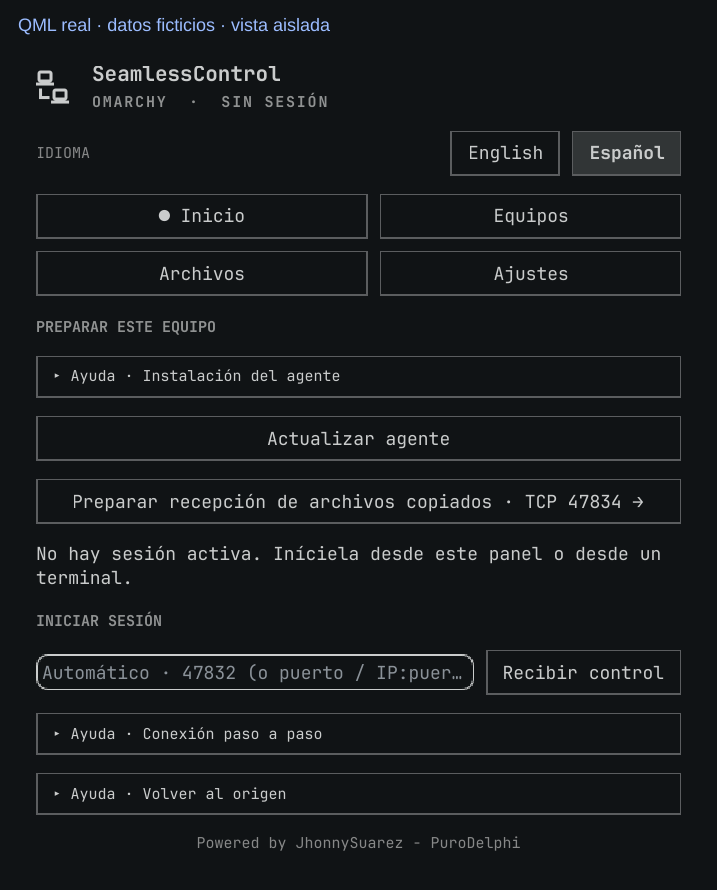
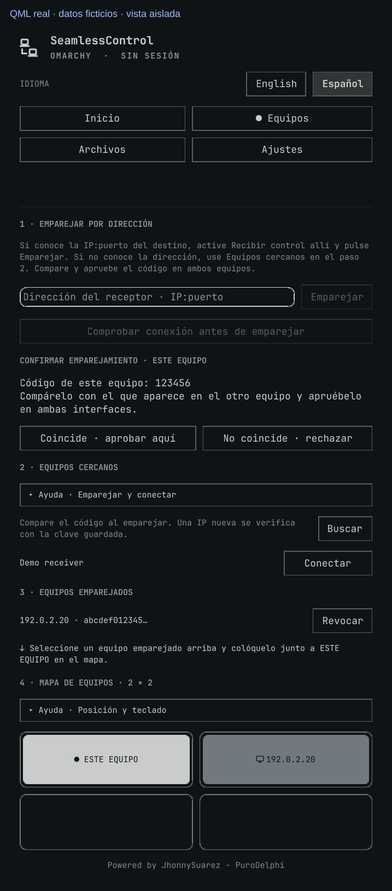
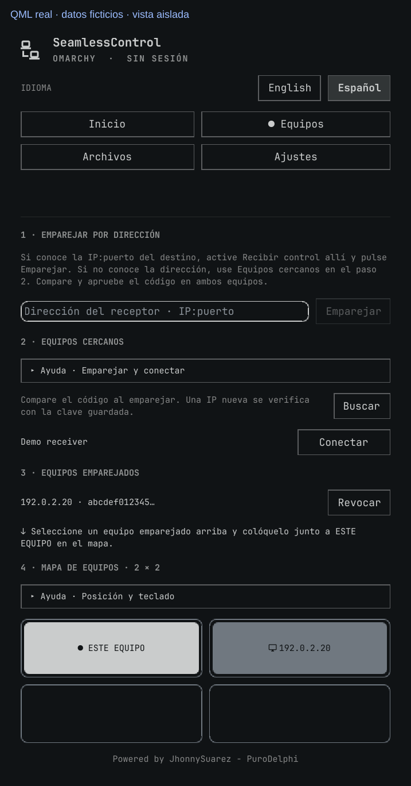
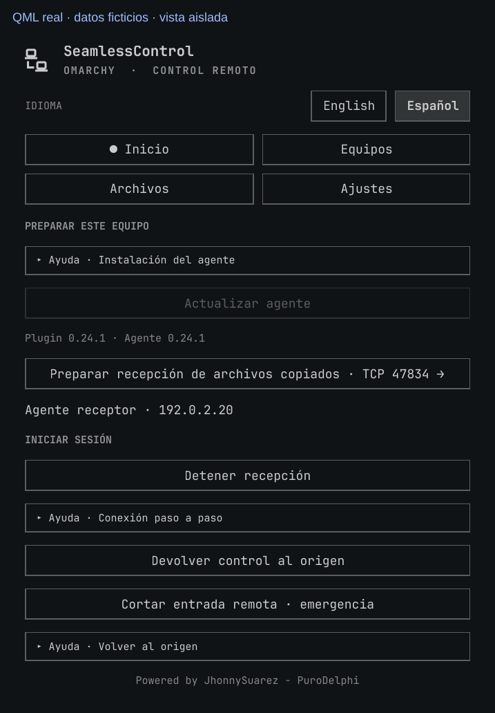
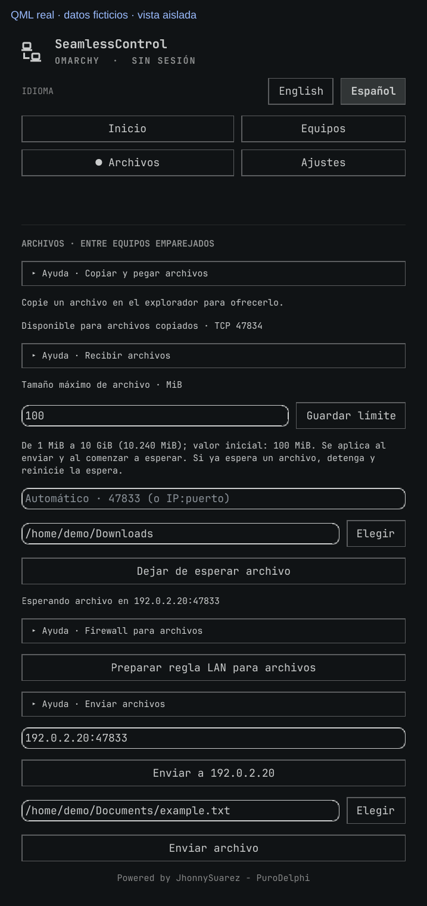
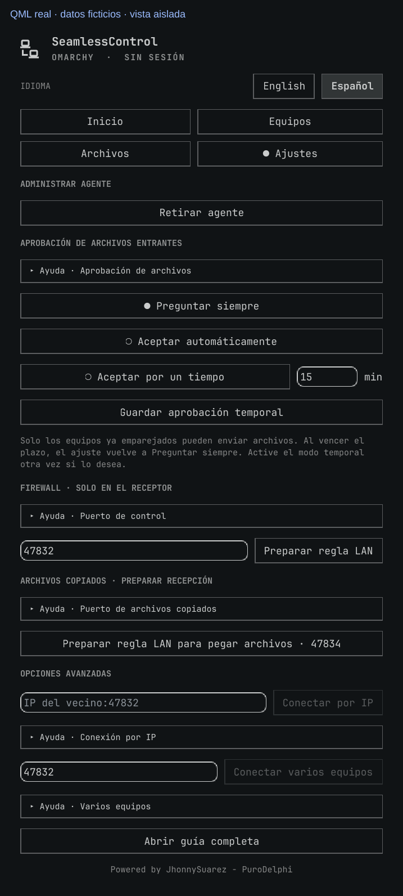
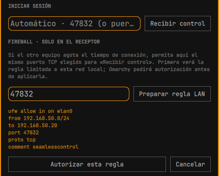

# Guía de uso de SeamlessControl · Omarchy

[Volver al README](../README.es.md) · [English](USER-GUIDE.md)

**Usa un ratón y teclado físicos en dos equipos de la misma LAN privada.** El **origen** es el equipo que tiene ese ratón y teclado; el **receptor** es el que quieres controlar. Son funciones de la sesión, no asignaciones permanentes. Ves la pantalla del propio receptor: SeamlessControl no transmite su imagen.

Instala el plugin y el agente en cada Omarchy siguiendo el [README](../README.es.md#1-instala-en-ambos-equipos). Para una pareja Omarchy–Windows, usa la [guía Windows](WINDOWS.es.md) en el lado Windows. Ambos equipos deben estar despiertos y tener abierta su sesión normal de escritorio.

**En esta guía:** [Primera conexión](#primera-conexión) · [Direcciones y mapa](#direcciones-y-mapa) · [Regresar y detener](#regresar-pausar-y-detener) · [Archivos](#archivos-dos-flujos-distintos) · [Puertos y permisos](#puertos-y-autorización-del-firewall) · [Problemas](#si-la-conexión-no-avanza) · [Seguridad y límites](#seguridad-y-límites-actuales) · [Actualizar y retirar](#actualizar-y-retirar)

Las imágenes son **renders sin pantalla del QML actual del plugin**, con estados, nombres, claves y carpetas ficticios. `192.0.2.20` es una dirección reservada para documentación, no una dirección que debas escribir en tu LAN. El renderer usa el panel y los componentes de interfaz reales de Omarchy en un contenedor de ventana aislado, sin ejecutar el agente ni usar tu configuración. Cada imagen está rotulada; no son fotografías ni pruebas de una conexión en vivo. Tu tema y la altura del panel pueden variar; desplázate para llegar a los controles inferiores.

## Primera conexión

### 1. En el receptor: recibir control

Abre SeamlessControl desde la barra de Omarchy. En **Inicio**, pulsa **Instalar agente** si hace falta y autoriza la instalación en la terminal que se abre. Una vez instalado, deja vacío el campo de dirección (**Automático · 47832…**) y pulsa **Recibir control**. Espera a que arriba diga **Disponible** y mantén la recepción activa.

El puerto de control predeterminado es TCP `47832`. Si el emparejamiento agota el tiempo, permite ese puerto en el receptor con los [pasos del firewall de abajo](#puertos-y-autorización-del-firewall) y reintenta. Abrir un puerto del firewall no inicia la recepción.

### 2. En el origen: emparejar una vez

Abre **Equipos → 2 · Equipos cercanos**, pulsa **Buscar** y luego **Emparejar** junto al receptor. Si no aparece, usa **1 · Emparejar por dirección** con la `IP:puerto` real del receptor en la LAN. Son **dos alternativas**, no dos pasos obligatorios.

Para una dirección manual, pulsa **Comprobar conexión antes de emparejar**. Si el puerto de control no responde, inicia **Recibir control** en el destino y autoriza allí su puerto TCP en el firewall. Si responde, continúa con el emparejamiento. Esta comprobación del puerto no establece confianza: para eso sigue siendo necesario comparar el código de seis cifras.

Aparece un **código de seis cifras** en ambos equipos. Compara las dos pantallas y pulsa **Coincide · aprobar aquí** en **cada una** solo si coinciden. Si no, pulsa **No coincide · rechazar**. Emparejar guarda la confianza; no inicia el control del ratón y teclado. Una huella larga de identidad no es este código de comparación.

Si el origen ya está recibiendo, pulsa primero **Detener recepción para emparejar** en el paso 1. El otro equipo debe seguir recibiendo. El corte de emergencia solo pausa un receptor; no lo libera para iniciar el emparejamiento.

### 3. En el origen: ubicar el receptor

En **Equipos → 3 · Equipos emparejados**, selecciona el receptor y colócalo en **4 · Mapa de equipos · 2 × 2**, directamente junto a **Este equipo**, en el lado donde está su pantalla física. Para una pantalla a tu derecha, usa la casilla derecha. También puedes arrastrar una ficha.

**Ubicar guarda una dirección, no una conexión.** En una sesión directa de dos equipos solo el origen necesita este mapa: el receptor aprende el borde de regreso al entrar el control. No configures un mapa inverso en el receptor solo para regresar.

### 4. En el origen: conectar y cruzar

Pulsa **Conectar** junto al receptor en **2 · Equipos cercanos**. Si el botón dice **Ubicar**, termina primero el paso 3. Si un receptor ya emparejado no aparece, usa **Ajustes → Conectar por IP** con su `IP:puerto` actual en la LAN.

Espera a **Listo**. La pestaña **Equipos** indica qué borde debes cruzar. Mueve el puntero por el **borde exterior de todo el escritorio del origen**, no por la separación entre dos monitores conectados a ese mismo equipo. Entonces la entrada del ratón y teclado pasa al receptor.

### 5. Regresar y detener al terminar

Cruza el **borde de entrada del receptor hacia el origen**, o pulsa **Escape en el teclado físico del origen**. Regresar mantiene la conexión lista para otro cruce. Aleja el puntero hacia dentro antes de cruzar otra vez.

Si falla el regreso por el borde, usa **Inicio → Devolver control al origen** en el receptor. Al terminar, pulsa **Inicio → Terminar sesión iniciada desde el panel** en el origen; usa **Detener recepción** en el receptor si ya no quieres dejarlo disponible.

## Direcciones y mapa

- **Una dirección no es una posición.** `IP:puerto` identifica un receptor en tu LAN; su casilla en el mapa elige el borde de cruce. Obtén la dirección real del receptor en su interfaz, o ejecuta `seamlesscontrold local-address 47832` en una terminal de ese receptor. No escribas la IP de ejemplo de una imagen.
- **Recepción automática:** dejar vacía la dirección de Inicio selecciona la IPv4 LAN local y el puerto de control de **Ajustes → Firewall · solo en el receptor** (inicialmente `47832`). Puedes escribir solo un puerto para elegir la IP automáticamente, o una `IP:puerto` local explícita. Usa el mismo puerto elegido en el receptor al emparejar, conectar y autorizar su regla de firewall.
- **Emparejar** autoriza un equipo. **Ubicar** selecciona su posición en el mapa. **Conectar** inicia realmente la sesión del origen. **Conectar por IP** también inicia el control; no es el campo de emparejamiento manual.
- Un equipo emparejado debe quedar junto a **Este equipo**, horizontal o verticalmente, para el botón Conectar normal; una posición diagonal no es un borde de salida. El mapa tiene cuatro casillas, no una casilla por cada monitor del mismo equipo.
- **Ubicar con teclado:** en Equipos, Tab llega al mapa y recorre sus casillas. Enter selecciona una ficha; las flechas llevan al destino; Enter la coloca. Escape cancela la selección. **Ayuda · Posición y teclado** despliega la explicación. Las demás filas de Ayuda también se despliegan con un clic o activación por teclado.
- **Cruce entre pantallas:** en Ajustes elige **Cruce fluido**, **Cruce deliberado** (sal del borde y crúzalo dos veces en 1,6 segundos) o **Proteger pantalla completa** (dos cruces solo cuando la ventana activa llena su monitor). Se aplica en la próxima conexión; Escape y el borde de regreso siguen disponibles.
- **Permisos por equipo:** en **Equipos → Equipos emparejados**, permite o deniega **Control**, **Texto** y **Archivos** para cada identidad guardada. Debajo aparece la última conexión de control autenticada. Control y texto se aplican en la próxima conexión; archivos, en la siguiente oferta. **Revocar** elimina la confianza y cierra el control afectado de inmediato.
- El descubrimiento solo es una pista. Una IP nueva se comprueba con la clave guardada; la fila puede mostrar **Actualizar IP** (actualmente esa etiqueta está en español en ambos idiomas). **Clave cambió** significa detenerse y comprobar qué equipo tiene esa dirección. No revoques una identidad todavía válida solo porque DHCP dio su dirección a otro sistema. Consulta [Problemas](#si-la-conexión-no-avanza).

## Regresar, pausar y detener

| Acción | Qué ocurre |
| --- | --- |
| Cruzar de regreso / Escape físico / **Devolver control al origen** | Devuelve la entrada al origen sin terminar la sesión. El botón de regreso normal del receptor aparece mientras lo están controlando. |
| **Pausar captura / Reanudar captura** en el origen | Desactiva/reactiva temporalmente la captura en el borde, manteniendo disponible la sesión. |
| **Terminar sesión iniciada desde el panel** en el origen | Termina el proceso de origen iniciado por este panel. Una sesión iniciada desde una terminal o servicio se detiene donde se inició. |
| **Detener recepción** en el receptor | Termina la recepción normalmente, también si el receptor está en pausa. Úsalo para cambiar de función o iniciar el emparejamiento desde ese equipo. |
| **Cortar entrada remota · emergencia** en el receptor | Desconecta la entrada remota y deja el receptor en pausa. La nueva entrada remota sigue bloqueada hasta **Reanudar recepción**. No es un regreso normal ni un cierre completo. |

## Archivos: dos flujos distintos

Los archivos requieren **equipos emparejados con SeamlessControl abierto**, pero **no una sesión de control del ratón y teclado**. Recibir un archivo no lo abre ni lo ejecuta. Ambos flujos autentican al emisor, aplican límites de tamaño y verifican SHA-256 antes de publicar un archivo completo.

### Copiar aquí, pegar allá · TCP 47834

1. **Receptor:** permite TCP `47834` una vez en su firewall LAN. En Omarchy usa **Inicio → Preparar recepción de archivos copiados · TCP 47834** o **Ajustes → Archivos copiados · preparar recepción**; prepara y autoriza la regla. Mantén cargado el widget de Omarchy (o abierta la app Windows).
2. **Origen:** copia **un archivo local, varios archivos o una carpeta** en el explorador. Con exactamente un equipo emparejado, se ofrece automáticamente. Con varios, elige **Archivos → Ofrecer archivo copiado a…**.
3. **Receptor:** si su modo de aprobación requiere preguntar, pulsa **Aceptar archivo** o **Rechazar**. Aparece una notificación con acciones aunque el panel esté cerrado o estés en otro workspace; la oferta también aparece arriba de cualquier pestaña del panel y en Archivos. Rechazar impide transferir el contenido.
4. Espera a que terminen la transferencia y verificación. Abre la carpeta de destino en el explorador del receptor y usa **Pegar**.

**Esperar un archivo no activa la detección de archivos copiados.** Es el otro flujo de abajo. Los archivos copiados se verifican en una carpeta temporal privada antes de publicar su referencia en el portapapeles. Esa carpeta tiene una cuota de tamaño; las sesiones temporales antiguas se limpian después de siete días. Pega los archivos que quieras conservar en una carpeta propia en vez de depender de esa carpeta como almacenamiento permanente.

Con varios archivos o una carpeta, el receptor ve **una sola oferta** con la cantidad de elementos y el tamaño total. Aprueba una vez y pega la **carpeta del grupo recibido**, ya verificada, en tu explorador. El límite de tamaño configurado cubre el grupo completo.

Una oferta sin aprobar caduca a los **dos minutos**. Vuelve a copiar el archivo o usa el botón de oferta para reintentar. Archivos de GNOME permite copiar desde **Recientes** y desde carpetas normales. Otros exploradores deben publicar un archivo local en formatos de portapapeles compatibles; archivos remotos, enlaces simbólicos y operaciones de cortar/mover no se ofrecen. Un grupo copiado se muestra como una sola oferta, con cantidad de elementos y tamaño total; después de aprobarlo, pega la carpeta recibida para conservar su contenido junto. Ambos equipos necesitan una versión compatible con grupos. Se admiten hasta 256 archivos y carpetas (incluidos los elementos internos) por grupo; el límite de tamaño configurado se aplica al grupo completo. Cambia el nombre de un archivo que contenga `:` antes de enviarlo: ese carácter se rechaza por seguridad compatible con Windows.

### Enviar directamente a una carpeta · TCP 47833 predeterminado

1. **Receptor → Archivos:** selecciona un **Directorio de destino** con **Elegir**. Deja la dirección de recepción en Automático, o escribe una `IP:puerto` local.
2. Pulsa **Preparar regla LAN para archivos**, revisa el puerto de archivos y el alcance LAN, y después **Autorizar esta regla** si el firewall lo necesita.
3. Pulsa **Esperar un archivo** y espera a **Esperando archivo en** con la dirección del receptor.
4. **Origen → Archivos:** selecciona **Enviar a…** para el receptor emparejado o escribe su `IP:47833` real; si usa otro puerto de archivos, escribe ese puerto. Elige el archivo local y pulsa **Enviar archivo**.
5. **Receptor:** aprueba la oferta cuando se solicite. El archivo verificado se guarda directamente en la carpeta elegida; no hay que pegarlo. Pulsa **Esperar un archivo** otra vez para el siguiente envío.

### Límite de tamaño y aprobación entrante

En **Archivos → Tamaño máximo de archivo · MiB**, ajusta **1–10.240 MiB** (hasta 10 GiB; inicialmente **100 MiB**) y pulsa **Guardar límite** en cada equipo. Emisor y receptor aplican sus propios límites, también a los archivos copiados. Si un receptor manual ya está esperando, detén y reinicia **Esperar un archivo** después de cambiar su límite.

En **Ajustes → Aprobación de archivos entrantes**, elige cómo **este receptor** acepta ambos flujos:

| Modo | Cómo aprueba |
| --- | --- |
| **Preguntar siempre** (predeterminado) | Acepta o rechaza cada oferta. |
| **Aceptar automáticamente** | Acepta archivos de emisores ya emparejados sin preguntar; se mantienen las comprobaciones de autenticación, tamaño, espacio y verificación. Úsalo solo con equipos en los que confíes para enviar archivos sin pedir permiso. |
| **Aceptar por un tiempo** | Escribe **1–1.440 minutos**, pulsa **Guardar aprobación temporal** y aprueba el primer archivo de cada emisor. Los siguientes archivos de ese emisor se aceptan durante su plazo. Rechazar no abre un plazo. Al vencer un plazo activo o reiniciar el plugin, el modo vuelve a **Preguntar siempre**. Activa de nuevo el modo temporal para otro plazo. |

El permiso temporal pertenece a la identidad autenticada del remitente, no a su dirección IP. Revocar el emparejamiento borra ese permiso; otro equipo emparejado en la misma dirección debe solicitar aprobación para su primer archivo.

La aprobación **no** abre puertos del firewall, inicia el receptor manual ni autoriza el control del ratón y teclado. En Windows usa sus ajustes equivalentes de aprobación y firewall descritos en la [guía Windows](WINDOWS.es.md).

## Puertos y autorización del firewall

| Uso | Puerto predeterminado | Qué debe estar activo en el receptor | Dónde está la regla en Omarchy |
| --- | --- | --- | --- |
| Control del ratón/teclado y portapapeles de texto | TCP `47832` | **Inicio → Recibir control** | **Ajustes → Firewall · solo en el receptor** |
| Envío manual de archivos a una carpeta | TCP `47833` | **Archivos → Esperar un archivo**, una vez por oferta | **Archivos → Preparar regla LAN para archivos** |
| Copiar/pegar archivos | TCP `47834` | Widget Omarchy cargado / app Windows abierta | **Ajustes → Archivos copiados · preparar recepción** |
| Descubrir receptores cercanos | UDP `5353` (mDNS) | Receptor de control anunciado en la LAN | Política multicast/mDNS de la red; las reglas TCP del panel no configuran esto |

**En el equipo receptor**, prepara la regla para el puerto exacto, comprueba su **interfaz, subred LAN e IP de destino**, pulsa **Autorizar esta regla** y acepta la solicitud de autorización del sistema. Preparar la regla no cambia nada por sí solo. Cancela si el alcance no es correcto; no expongas estos puertos a Internet ni uses redirección de puertos en el router.

El asistente añade una regla limitada de **UFW**; no activa UFW ni configura otros cortafuegos. Cada puerto TCP necesita su **propia** regla si está bloqueado. Si cambia tu IP, interfaz o subred, revisa las reglas anteriores y prepara la nueva; las reglas antiguas no se retiran automáticamente. La [guía técnica](TECHNICAL.es.md#firewall) explica cómo revisarlas/retirarlas manualmente. Si mDNS está bloqueado pero TCP funciona, usa el emparejamiento/conexión por dirección.

## Si la conexión no avanza

| Lo que ves | Qué hacer |
| --- | --- |
| No aparece el receptor en **2 · Equipos cercanos** | Mantén activa la recepción allí y pulsa **Buscar** en el origen. Empareja un equipo nuevo en **1 · Emparejar por dirección**; conecta uno ya emparejado y ubicado en **Ajustes → Conectar por IP**. |
| El emparejamiento agota el tiempo / **Conectando** antes de autenticarse por red | Comprueba la dirección real, el receptor activo y su regla TCP de control. Reintenta el emparejamiento y aprueba el código nuevo en ambas pantallas. No desactives todo el firewall. |
| **Clave cambió** | Comprueba la identidad del receptor y si otro sistema tiene ahora esa IP. No apruebes a ciegas cambios inesperados. Si quieres sustituir/revocar la confianza, usa **Equipos → Equipos emparejados → Revocar**, luego empareja de nuevo y compara el código nuevo en ambos equipos actualizados. |
| **Red conectada. Preparando la captura del ratón y teclado…** durante más de 15 segundos | En el origen, pulsa **Reiniciar captura de este equipo** cuando aparezca. Cierra esta sesión atascada iniciada desde el panel y reinicia el portal de captura del origen; puede interrumpir otras apps que comparten pantalla. Tras el mensaje de reinicio, pulsa **Conectar** otra vez. No es un problema de firewall si ya se autenticó. |
| **Listo**, pero no cruza | Comprueba que el receptor esté junto al origen en su mapa y cruza el borde exterior indicado del escritorio. Si pide alejarte del borde, mueve el puntero hacia dentro y vuelve a cruzar. |
| **Reconectando** | Deja que el agente reintente y lee **Último intento**. No inicies otra sesión de origen. Si cambió el receptor/dirección, déjalo disponible de nuevo, termina la sesión del origen, Busca y Conecta otra vez. |
| El puntero queda en el receptor | Usa Escape físico o **Devolver control al origen**. Si falla el regreso normal, usa el corte de emergencia del receptor y reanuda solo cuando sea seguro. |
| **Bloqueado** | Desbloquea localmente. La app no desbloquea equipos a distancia; un estado de bloqueo desconocido también impide la entrada. Aleja el puntero del borde del origen antes de cruzar otra vez. |
| La oferta de archivo copiado nunca llega | Mantén activas ambas apps/widget, comprueba emparejamiento y TCP `47834` del receptor, y copia un archivo local compatible. **Esperar un archivo** y abrir solo `47832` o `47833` no activan este flujo. |
| El envío manual agota el tiempo | Activa otra vez **Esperar un archivo** y usa la dirección y puerto de archivos anunciados; comprueba su regla independiente del firewall. |

El botón de reparar captura solo aparece en una **sesión de origen iniciada desde el panel** si la preparación de captura, ya autenticada, lleva 15 segundos pendiente. Si la parada normal del panel se atasca, envía una señal más fuerte después de dos segundos. Para diagnóstico y soporte sin cambiar ajustes del sistema, consulta la [guía técnica](TECHNICAL.es.md) y la [guía de soporte](../SUPPORT.es.md).

## Seguridad y límites actuales

- Usa una **LAN privada y equipos de confianza**. Las sesiones de red se cifran/autentican con Noise XX y claves fijadas. Compara los códigos de emparejamiento en ambas pantallas físicas; el descubrimiento y las IP por sí solos no establecen confianza. **Revocar** bloquea esa clave guardada y cierra su sesión; volver a conectar requiere un emparejamiento nuevo explícito.
- Bloquear el origen Omarchy desactiva la captura; bloquear el receptor, o no poder determinar su estado de bloqueo, corta la entrada remota. Las teclas/botones pulsados se liberan cuando termina la entrada. Es **control de un escritorio con sesión abierta**, no inicio de sesión remoto, desbloqueo a distancia ni acceso a UAC/escritorios seguros de Windows. Consulta la guía Windows para sus límites de permisos. El bloqueo manual durante control remoto aún requiere verificación física; **devuelve y detén el control antes de bloquear manualmente**.
- Mientras un origen Omarchy controla activamente un par, el widget cargado en la barra inhibe el **bloqueo automático por inactividad** de Omarchy cuando este respeta inhibidores. El bloqueo manual sigue funcionando; el inhibidor termina al regresar o descargar el widget. Tenlo en cuenta si dejas el origen desatendido.
- Estas protecciones de bloqueo se refieren al **control de entrada**, no prometen detener todos los receptores de archivos ni borrar el portapapeles. Detén la app/widget o cambia la aprobación de archivos por separado si ya no quieres ofertas. Se excluyen las selecciones Wayland sensibles cuando la aplicación las marca; no supongas que todos los gestores de contraseñas o secretos copiados llevan esa marca.
- Durante una conexión de control, el **portapapeles de texto** se sincroniza automáticamente (UTF-8, hasta 256 KiB). No se sincronizan imágenes. Copiar archivos usa el flujo independiente de aprobación de arriba; funciona sin control.
- **Ajustes → Conectar varios equipos** es experimental: un origen y **dos o tres receptores** en un mapa 2 × 2 conectado. Empareja y ubica los equipos en los mapas participantes, mantén todos los receptores activos en el mismo puerto de control e inicia la malla desde el origen. El portapapeles se comparte entre los receptores conectados. Para dos equipos en total usa **Conectar** normal. La malla física de varios equipos, cambios rápidos de destino y recuperación de red no están completamente validados; consulta el [registro de pruebas](TEST-RESULTS.es.md), no los renders de documentación, para los resultados observados.

## Actualizar y retirar

Detén las sesiones activas antes de instalar, actualizar o retirar. **Inicio → Actualizar agente** abre una terminal de Omarchy para instalar el agente actual y las dependencias que falten. Actualiza el **plugin** por separado y reinicia el shell de Omarchy siguiendo el [README](../README.es.md#actualizar-o-retirar); vuelve a abrir el panel después. Si faltan las pestañas actuales o los ajustes de aprobación, el shell puede tener cargado un panel anterior.

Inicio muestra las versiones del plugin y del agente instalado. Si son distintas, termina la sesión y pulsa **Actualizar agente**. Espera a que finalice la terminal de instalación; después vuelve a Inicio y comprueba que coincidan.
El panel confirma la finalización solo cuando el instalador termina correctamente y el agente nuevo informa la versión del plugin. Si falla, lee el error en la terminal y vuelve a intentarlo; abrir la terminal no significa que la actualización haya concluido.

**Ajustes → Retirar agente** pide confirmación y retira el agente administrado y solo los paquetes que SeamlessControl instaló para él. Conserva las claves emparejadas y el mapa. Retirar el agente no retira el plugin ni sus reglas de firewall; el README y la guía técnica explican esos pasos separados. Si el panel no puede abrir la terminal de instalación, usa la [instalación manual de la guía técnica](TECHNICAL.es.md#paquetes-y-actualizaciones).

La [guía técnica](TECHNICAL.es.md) describe comandos manuales, protocolo y diagnóstico. El [registro de pruebas](TEST-RESULTS.es.md) conserva observaciones históricas y las distingue de las instrucciones actuales.
