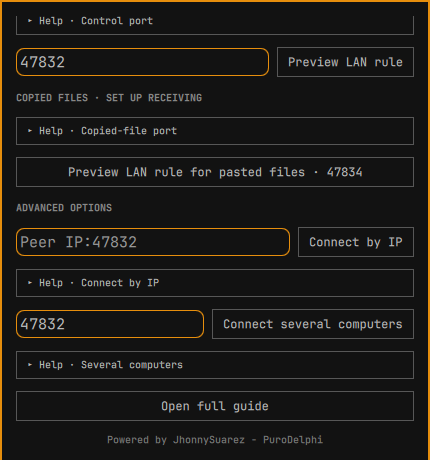

# SeamlessControl user guide

[Back to README](../README.md) · [Español](USER-GUIDE.es.md)

This guide shows the Omarchy panel with two Omarchy computers: the **source** has the physical mouse and keyboard, and the **receiver** accepts control. SeamlessControl also connects Omarchy and Windows; follow the [Windows guide](WINDOWS.md) for that setup. Set up the plugin and agent on both Omarchy computers first. The screenshots show fictional computer names and addresses.

The panel has four sections. **Home** shows agent installation, control status and immediate session actions. **Computers** contains discovery, pairing, trusted peers and the screen layout. **Files** contains copied-file offers, manual transfers and the size limit. **Settings** contains incoming file approval, receiver firewall rules, agent removal and advanced connection options. Home has a shortcut to set up the copied-file port. Incoming copied-file offers that need approval also appear at the top of every section with **Accept** and **Decline** buttons; pairing codes and manual file offers open their relevant section automatically.

After updating the plugin, restart the Omarchy shell as described in the [README](../README.md#update-and-remove) and reopen the panel. If **Incoming file approval** is missing under **Settings**, the shell is still showing an older loaded panel.

## A tour of the Omarchy panel

These screenshots come from the current Omarchy panel. The computer name, address, key and home directory shown in them are examples. The small **Help** rows expand when clicked or focused and activated with Enter; they are collapsed by default.

### Home: prepare this computer and start receiving

- **English / Español** changes the panel language. **Install agent** appears after adding the plugin; **Update agent** appears once installed. The button opens a terminal to install or update the agent and required packages. Stop an active session before updating.
- **Set up copied-file receiving · TCP 47834** opens the matching firewall section in Settings. It is needed on a computer that will receive files copied in another computer's file manager.
- **Automatic · 47832 (or port…)** is the address for **Receive control**. Leave it on Automatic for the normal LAN setup; choose another port only when both the listener and its firewall rule use that port. **Receive control** starts this computer as a receiver and makes it discoverable.
- The status line reports whether the agent is available, ready, controlling, paused or reconnecting. The session controls appear here when relevant: **Pause/Resume capture**, **Return control to source**, **Cut remote input · emergency / Resume receiving**, **Restart capture on this computer**, and **Stop session started here**. Their actions are explained [below](#what-the-other-controls-do).

### Computers: discover, pair, place and connect

- **Computer layout** shows **This computer** and the cells beside it. Drag a paired computer into the cell matching its physical screen, or select its tile and destination cell. The **Help · Layout and keyboard** row explains the Tab, Enter, arrow key and Escape controls. Placement saves the crossing direction; it does not start a session.
- **Computers on the network** shows receivers advertising on the LAN. **Scan** refreshes the list. **Pair** appears for a new computer; compare the six-digit code on both computers and approve on each. **Connect** appears for a trusted computer and starts control. If discovery is unavailable, enter `IP:port` in **Manual option** and choose **Pair** for a new computer.

- **Paired computers** lists saved trust keys. **Revoke** removes a computer's trust after confirmation; connecting it again requires a new pairing. If a known computer gets a new IP, the panel checks its saved identity rather than trusting an address alone. A **Key changed** warning requires checking the computer and pairing it again.
- A pending pairing shows the code and **Codes match · approve here / Do not match · reject**. Compare with the other screen before approving. If a receiver is placed but not discovered, **Settings → Connect by IP** can start its session.

### Files: copy and paste, or send directly to a folder

- **Copy and paste files** watches for one local file copied in a file manager. Its status says whether TCP `47834` is ready. With one paired computer, the offer can start automatically; with several, **Offer copied file to…** lets you choose the receiver. The receiver sees **Accept file / Decline** unless its approval setting allows automatic acceptance. After verification, paste into a destination folder.
- **Maximum file size · MiB / Save limit** sets this computer's limit from 1 MiB to 10 GiB (10,240 MiB); the initial value is 100 MiB. Both sender and receiver enforce their own limits. Restart **Wait for a file** after changing the limit while it is already waiting.
- **Automatic · 47833 (or IP:port)** and the folder **Choose** button configure a manual receiver. **Wait for a file** listens for one offer; **Stop waiting for a file** ends it. **Preview file LAN rule** then **Authorize this rule** allows that receiver port through the Omarchy firewall if needed.

- For a manual transfer, choose the paired receiver with **Send to…** or enter its `IP:47833`, choose a local file, then **Send file**. The receiver accepts or declines the offer. Repeat **Wait for a file** for another transfer. This flow saves directly to the chosen folder and uses TCP `47833`; copied-file paste uses TCP `47834`.

### Settings: approvals, firewall and advanced connections

- **Remove agent** asks for confirmation and removes the managed agent and packages SeamlessControl installed for it. Paired keys and the layout stay saved; the README explains how to remove the plugin itself.
- **Incoming file approval** applies to both file workflows. **Ask every time** is the default; **Accept automatically** accepts files from paired computers without a prompt; **Ask, then accept for a while** asks for the first file from each paired computer and remembers that approval for the selected number of minutes (1–1,440). When the time ends or the app restarts, the setting visibly returns to **Ask every time**. The detailed behavior is [below](#choose-how-incoming-files-are-approved).
- **Firewall · receiver only** accepts the control listener's TCP port, normally `47832`. **Preview LAN rule** shows the rule restricted to the detected local network. Review it, then **Authorize this rule** and approve Omarchy's system prompt. The rule is needed on the receiver when connections time out.

- **Copied files · set up receiving** prepares the separate TCP `47834` rule for pasted files; review and authorize it on a computer that will receive them. The **Files** tab has a corresponding rule for manual transfers on TCP `47833`. Opening one port does not open the others.
- **Connect by IP** starts control of a computer already paired and placed when discovery misses it. **Connect several computers** starts a mesh session with two or three receivers placed around one source; with one receiver, use its normal **Connect** button. **Open full guide** opens this project's README.

## First connection, one step at a time

1. **Start the receiver.** On the computer you want to control, open SeamlessControl. In **Start a session**, leave the address empty and select **Receive control**. The top of the panel should say **Available**. Leave this session running.

   

2. **Find and pair it.** On the source, open **Computers** and look under **Computers on the network**. Select **Scan** if it is not listed. Select **Pair** beside the receiver. A six digit code appears on **both** computers. Compare the codes and select **Codes match · approve here** on each. You pair a trusted computer once; later sessions reuse its saved key. The much longer **Local identity** is a fingerprint, not the code to type.

   **Pair** authorizes this receiver once. **Connect** starts a new control session whenever you want to use it.

   

3. **Place the computers.** In **Computers → Computer layout**, place the receiver in the cell beside **This computer** that matches its real position. Do the reverse on the receiver, placing the source beside **This computer**. Select a computer tile, then select the destination cell, or drag it. With the panel open, press Tab to highlight a cell (more presses cycle through the four cells), Enter to select its tile, the arrow keys to reach the target cell, and Enter again to place it. Escape cancels a selection. This only saves the crossing direction; it does not start control.

4. **Connect from the source.** On the source, select **Connect** beside the discovered receiver. Wait for **Ready** at the top. The panel names the edge to cross. If the source has several monitors, use the **outer edge of the whole source desktop**, not a seam between its monitors. Move the pointer through that edge to enter the receiver.

   

   

5. **Return.** Move through the receiver's edge toward the source, or press **Escape** on the physical keyboard. If the pointer does not return, select **Return control to source** in the receiver's panel. Select **Stop session started here** on the source when finished.

The [README](../README.md) explains installation, updating and removal. Pairing, layout and starting a session are separate actions; changing the layout alone does not connect the computers.

## If the connection does not progress

| What the panel shows | What to do in the panel |
| --- | --- |
| No receiver in **Computers on the network** | Keep **Receive control** active on the receiver, then select **Scan** on the source. For a new computer, enter its `IP:port` in the manual **Pair** field. For an already paired and placed computer, use **Connect by IP**. |
| Pairing times out | On the receiver, open **Settings → Firewall · receiver only**: preview the LAN rule for the same port as **Receive control**, then authorize it. Retry **Pair** on the source and approve the new code on both computers. |
| **Connecting**, without a network connection | Check that **Receive control** is still active on the receiver and that its firewall permits the selected port. Stop the source session and select **Connect** again. |
| **Network connected. Preparing mouse and keyboard capture…** for more than 15 seconds | On the source, select **Restart capture on this computer**. This ends the stuck attempt and restarts Omarchy's input capture service. It can interrupt other screen-sharing apps on that computer. When the panel says capture restarted, select **Connect** again. |
| **Ready**, but the pointer does not cross | Check the receiver's position in **Computer layout** on the source. Cross the indicated **outer** edge of all source monitors. If the panel says **Move pointer away from edge**, move inward first, then cross again. |
| **Reconnecting** | The agent retries on its own. Wait a moment and read **Last attempt** for the cause; do not start a second connection while it is retrying. If the receiver stopped or its address or port changed, start **Receive control** there, then select **Stop session started here** on the source, **Scan**, and **Connect** again. A firewall change is only relevant when the connection times out before authentication. |
| Pointer stays on the receiver | Press **Escape** on the source keyboard or select **Return control to source** on the receiver. **Cut remote input · emergency** on the receiver disconnects and pauses it; select **Resume receiving** before another attempt. |

The capture repair button appears only when a panel-started source session has already reached the receiver but its desktop capture setup has stayed pending for 15 seconds. If **Stop session started here** itself hangs, the panel sends a stronger stop signal after two seconds.

## What the other controls do

| Control | Use |
| --- | --- |
| **Connect by IP** | Starts control when the receiver is already paired and placed but discovery does not list it. Enter its `IP:port`. The nearby **Pair** field is for trusting a new computer, not for starting control. |
| **Text clipboard** | While connected, copied text follows control between paired computers automatically. File copying uses the separate approved flow below; images are not synchronized. |
| **Connect several computers** | Experimental mesh mode for **one source plus two or three receivers** in a connected 2 × 2 layout. Pair and place every computer; start **Receive control** on each receiver, using the same port. Then select this button on the source. Text clipboard updates are shared between connected receivers. With only two computers in total, use the regular **Connect** button. Mesh still needs physical testing with more than two computers. |
| **Pause capture / Resume capture** | Temporarily stops or resumes edge capture on the source while keeping its session available. |
| **Return control to source** | Requests a return from the receiver while it is being controlled. |
| **Cut remote input · emergency / Resume receiving** | Disconnects remote input at the receiver and blocks new input until you explicitly resume. Use it if the source cannot recover control. |
| **Revoke** | Removes trust for a paired computer. A future connection needs a new pairing and code comparison. |
| **Wait for a file / Send file** | On the receiver, choose a folder and select **Wait for a file**. Wait until the panel shows **Waiting for a file on** with its address. **Before the first transfer**, select **Preview file LAN rule**, review the rule for port `47833`, then select **Authorize this rule** and approve the system prompt. Control port `47832` does not open the file port. On the source, choose the paired receiver and a file, then **Send file**. Approve the offer on the receiver. Select **Wait for a file** again for every subsequent file. The destination may choose a different file port; enter that same port in the source's receiver address. In **Files**, set **Maximum file size** on each computer (1 MiB to 10 GiB; initially 100 MiB) and select **Save limit**. The sender and receiver each enforce their own limit, so the file must fit both. If the receiver is already waiting, stop and start waiting again. Existing files are never overwritten. |
| **Preview LAN rule / Authorize this rule** | On the receiver, review and authorize a firewall rule limited to the detected LAN and chosen TCP port. Remote control and file receiving use separate ports and need separate rules when the firewall blocks them. |
| **Update agent / Remove agent** | Installs the current agent version or removes it and packages installed specifically by SeamlessControl. Stop active sessions first. Pairing keys and layout are kept. |

### Copy a file and paste it on another computer

Use the **Copy here, paste there** card at the top of **Files** in Windows. **Wait for a file** is the separate manual Send file workflow on port `47833`; it does not start copied-file detection.

1. Keep SeamlessControl running on both paired computers. On the **receiver**, allow the LAN rule for **TCP 47834**: use **Home → Set up copied-file receiving** or **Settings → Copied files → Preview LAN rule for pasted files** in the Omarchy panel; on Windows use **Settings → Windows firewall → Allow pasted-file port 47834**. This is separate from control (`47832`) and manual file sending (`47833`).
2. Copy **one local file** in the source file manager. With exactly one paired computer, SeamlessControl offers it automatically. With more than one, open **Files** and choose **Offer copied file to…**. The source need not start a control session.
3. On the receiver, a prominent notification appears even when the Omarchy panel is closed or the Windows app is in the tray. Select **Accept** or **Decline** there; the same buttons remain in **Files**. Nothing is downloaded before acceptance.
4. After verification, open the destination folder in the receiver's file manager and press **Paste**. The verified file stays in SeamlessControl's private staging folder until pasted; files are kept for up to seven days and staging is size limited. To send several files, copy and approve them one at a time.

The offer expires after two minutes without approval; copy the file again or use the offer button to retry. Both apps show transfer progress. The maximum file size setting on **both** computers applies to copied files too. If the offer cannot reach the receiver, confirm that the receiver is running and its TCP `47834` rule is allowed. **Wait for a file / Send file** remains available for choosing a destination folder directly.

### Choose how incoming files are approved

On each receiving computer, open **Settings → Incoming file approval**. The preference applies to copied files on TCP `47834` and manual **Wait for a file** transfers on TCP `47833`:

- **Ask every time** (default): approve or decline each offer.
- **Accept automatically**: files from already paired computers are accepted without an approval prompt. The sender must still pass authentication, size and storage checks.
- **Ask, then accept for a while**: enter 1–1,440 minutes. Approve the first file from each paired computer; that computer’s later files are accepted until its time expires. When any active window ends, the setting switches to **Ask every time** on both apps, so the next file asks again. A declined file does not start the time window. Restarting the app/plugin also ends temporary approval. Select timed mode again to open a new window.

In Windows, the incoming copied-file dialog now shows the sender, file size and paste instructions in **one prompt**. After acceptance, transfer and verification progress appears in **Activity**; there is no second confirmation to dismiss. In automatic mode there is no approval prompt. Keep SeamlessControl running on the receiver. These modes do not open firewall ports or start **Wait for a file** automatically.

You can copy from **Recent** in GNOME Files as well as from a normal folder. Other Linux file managers can work when they expose a local file through the usual clipboard file formats; the exact behavior depends on the manager. Copy one regular local file at a time. Folders, remote locations and multi-file selections are not offered automatically; use **Send file** for a file that cannot be copied this way.

The [technical guide](TECHNICAL.md) covers the protocol, manual diagnostics and current test limits.
