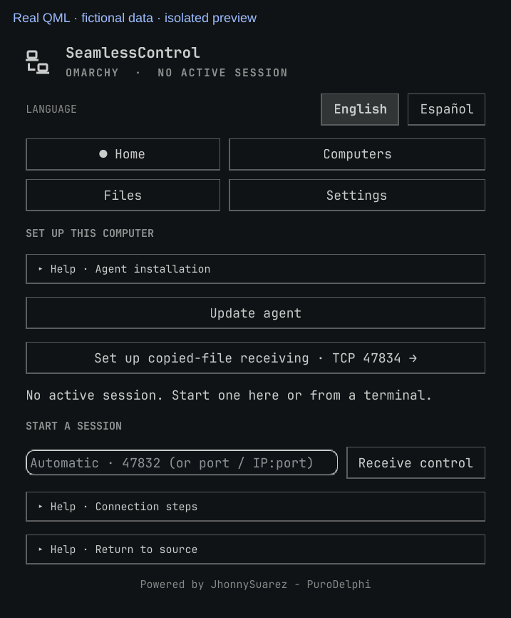
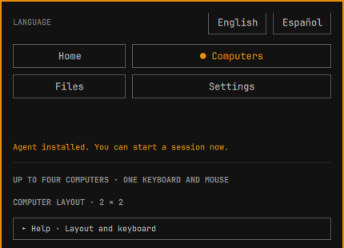
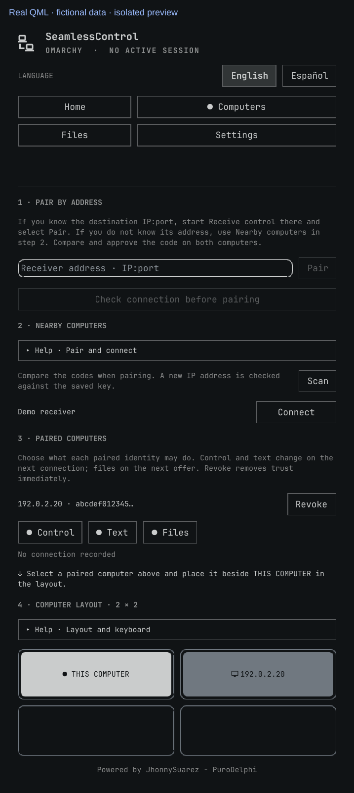
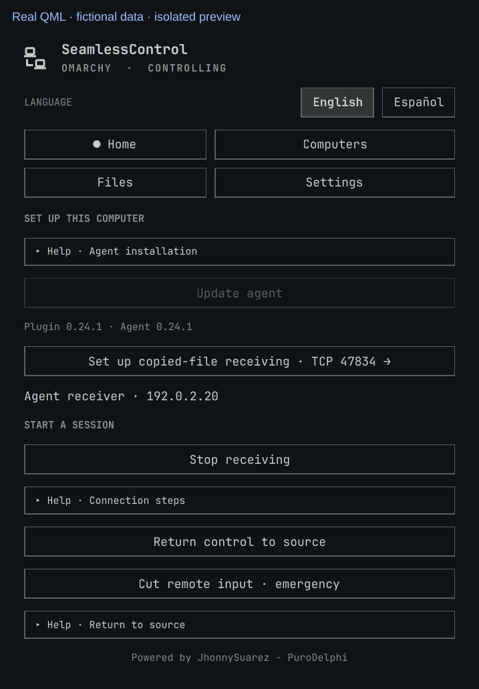
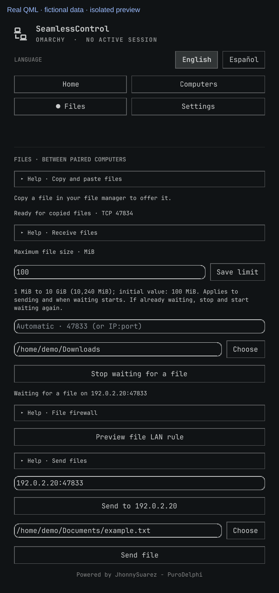
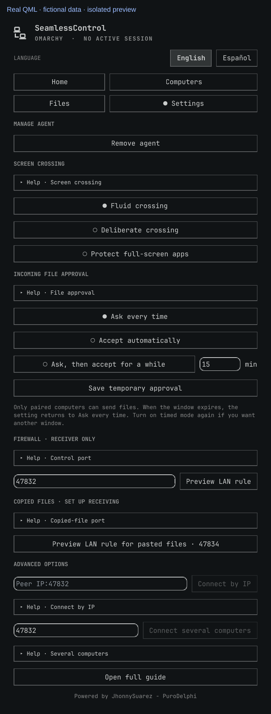

# SeamlessControl user guide · Omarchy

[Back to README](../README.md) · [Español](USER-GUIDE.es.md)

**Use one physical mouse and keyboard on two computers on the same private LAN.** The **source** is the computer with that mouse and keyboard; the **receiver** is the computer you want to control. These are session roles, not permanent assignments. You see the receiver's own screen: SeamlessControl does not stream its display.

Install the plugin and agent on each Omarchy computer using the [README](../README.md#1-install-on-both-computers). For an Omarchy–Windows pair, use the [Windows guide](WINDOWS.md) on the Windows side. Both computers must be awake and signed in to their normal desktop.

**In this guide:** [First connection](#first-connection) · [Addresses and layout](#addresses-and-layout) · [Return and stop](#return-pause-and-stop) · [Files](#files-two-separate-workflows) · [Ports and permissions](#ports-and-firewall-permission) · [Troubleshooting](#if-the-connection-does-not-progress) · [Safety and limits](#safety-and-current-limits) · [Update and remove](#update-and-remove)

Images below are **offscreen renders of the current plugin QML**, with fictional state, names, keys and folders. `192.0.2.20` is a documentation-only address, not an address to enter on your LAN. The renderer uses the real panel and Omarchy UI components in an isolated window container, without running the agent or using your configuration. Each image is labelled; these are not photographs or evidence of a live connection. Your theme and panel height may differ; scroll to reach the lower controls.

## First connection

### 1. On the receiver: start receiving

Open SeamlessControl from the Omarchy bar. In **Home**, select **Install agent** if necessary and authorize the installation in the terminal that opens. Once installed, leave the address field empty (**Automatic · 47832…**) and select **Receive control**. Wait for **Available** at the top and keep receiving active.

The default control port is TCP `47832`. If pairing times out, allow that port on the receiver using the [firewall steps below](#ports-and-firewall-permission), then retry. Opening a firewall port does not start receiving.

### 2. On the source: pair once

Open **Computers → 2 · Nearby computers**, select **Scan**, then **Pair** beside the receiver. If discovery misses it, use **1 · Pair by address** with the receiver's actual LAN `IP:port` instead. These are **two alternatives**, not two required steps.

For a manual address, select **Check connection before pairing**. If the control port does not respond, start **Receive control** on the destination and allow its TCP control port in that computer's firewall. If it responds, proceed with pairing. The port check does not establish trust: the matching six-digit code still does that.

A **six-digit code** appears on both computers. Compare the two screens and select **Codes match · approve here** on **each** only if they agree. Otherwise select **Codes differ · reject**. Pairing saves trust; it does not start mouse and keyboard control. A long identity fingerprint is not this comparison code.

If the source is already receiving, select **Stop receiving to pair** in step 1 first. The other computer must keep receiving. The emergency cut only pauses a receiver; it does not free it to initiate pairing.

### 3. On the source: place the receiver

In **Computers → 3 · Paired computers**, select the receiver, then place it in **4 · Computer layout · 2 × 2**, directly beside **This computer** on the side matching its physical screen. For a screen on your right, use the right-hand cell. You can also drag a tile.

**Placement saves a direction, not a connection.** For a direct two-computer session, only the source needs this layout: the receiver learns the return edge when control enters it. Do not set up a reverse receiver layout just to return.

### 4. On the source: connect and cross

Select **Connect** beside the receiver in **2 · Nearby computers**. If that button says **Place**, first finish step 3. If the already paired receiver is not discovered, use **Settings → Connect by IP** with its current LAN `IP:port`.

Wait for **Ready**. The **Computers** tab tells you which edge to cross. Move the pointer through the **outer edge of the entire source desktop**, not a seam between two monitors connected to that same computer. Mouse and keyboard input then goes to the receiver.

### 5. Return, then stop when finished

Cross the receiver's **entry edge toward the source**, or press **Escape on the source's physical keyboard**. Returning keeps the connection ready for another crossing. Move the pointer inward before crossing again.

If edge return fails, use **Home → Return control to source** on the receiver. When finished, select **Home → Stop session started here** on the source; use **Stop receiving** on the receiver if you no longer want it available.

## Addresses and layout

- **An address is not a direction.** `IP:port` identifies a receiver on your LAN; its cell in the layout chooses the crossing edge. Obtain the actual receiver address from its interface, or use `seamlesscontrold local-address 47832` in a terminal on that receiver. Never enter a screenshot's example IP.
- **Automatic receiving:** an empty Home address selects the local LAN IPv4 and the control port in **Settings → Firewall · receiver only** (initially `47832`). You can enter a port alone for automatic IP selection, or an explicit local `IP:port`. Match the receiver's chosen port when pairing, connecting and authorizing its firewall rule.
- **Pair** authorizes a computer. **Place** selects its layout position. **Connect** actually starts the source session. **Connect by IP** also starts control; it is not the manual pairing field.
- A paired computer must be adjacent horizontally or vertically to **This computer** for the normal Connect button; diagonal placement is not an exit edge. The layout has four cells, not one cell per monitor of the same computer.
- **Keyboard placement:** in the Computers tab, Tab reaches and cycles through layout cells. Enter selects a tile; arrows move to the destination; Enter places it. Escape cancels the selection. **Help · Layout and keyboard** expands the explanation. Other Help rows also expand with a click or keyboard activation.
- **Screen crossing:** in Settings choose **Fluid crossing**, **Deliberate crossing** (move away and cross twice within 1.6 seconds), or **Protect full-screen apps** (two crossings only while the active window fills its monitor). This applies on the next connection; Escape and the receiver's return edge still work.
- Discovery is only a hint. A new IP is checked against the saved key; the row can show **Actualizar IP** (currently this label is Spanish in both languages). **Key changed** means stop and check which computer owns that address. Do not revoke a still-valid identity merely because DHCP gave its address to another system. See [troubleshooting](#if-the-connection-does-not-progress).

## Return, pause and stop

| Action | What happens |
| --- | --- |
| Cross back / physical Escape / **Return control to source** | Returns input to the source without ending the session. The receiver's normal-return button appears while it is being controlled. |
| **Pause capture / Resume capture** on the source | Temporarily disables/re-enables edge capture while keeping the session available. |
| **Stop session started here** on the source | Ends the source process started by this panel. A session started from a terminal or service must be stopped where it was started. |
| **Stop receiving** on the receiver | Ends receiving normally, including a paused receiver. Use this to change roles or start pairing from that computer. |
| **Cut remote input · emergency** on the receiver | Disconnects remote input and leaves the receiver paused. New remote input stays blocked until **Resume receiving**. This is not a normal return or full shutdown. |

## Files: two separate workflows

Files require **paired computers with SeamlessControl running**, but **no mouse/keyboard control session**. Receiving a file does not open or execute it. Both flows authenticate the sender, apply size checks and verify SHA-256 before publishing a completed file.

### Copy here, paste there · TCP 47834

1. **Receiver:** allow TCP `47834` once through its LAN firewall. In Omarchy use **Home → Set up copied-file receiving · TCP 47834** or **Settings → Copied files · set up receiving**; preview and authorize the rule. Keep the Omarchy widget loaded (or the Windows app running).
2. **Source:** copy **one regular local file** in your file manager. With exactly one paired computer, it is offered automatically. With several, choose **Files → Offer copied file to…**.
3. **Receiver:** if its approval mode requires a prompt, select **Accept file** or **Decline**. An actionable desktop notification appears even with the panel closed or on another workspace; the offer also appears at the top of every panel tab and in Files. Rejection prevents content transfer.
4. Wait for transfer and verification to finish. Open the destination folder in the receiver's file manager and use **Paste**.

**Wait for a file does not turn on copied-file detection.** It is the other workflow below. Copied files are verified into a private staging folder before the clipboard points to them. Staging has a size quota; old staging sessions are cleaned up after seven days. Paste files you want to keep into your own folder rather than relying on staging as permanent storage.

An unapproved offer expires after **two minutes**. Copy the file again or use the offer button to retry. GNOME Files supports copying from **Recent** as well as normal folders. Other file managers must expose a local file in supported clipboard formats; folders, remote files, symbolic links, multi-file selections and cut/move operations are not offered as ordinary copied files. Send files one at a time. Rename a file containing `:` before sending: that character is rejected for Windows-compatible safety.

### Send directly to a folder · TCP 47833 by default

1. **Receiver → Files:** choose a **Destination folder** with **Choose**. Leave the receiving address on Automatic, or enter a local `IP:port`.
2. Select **Preview file LAN rule**, review the file port and LAN scope, then **Authorize this rule** if the firewall needs it.
3. Select **Wait for a file** and wait for **Waiting for a file on** with the receiver address.
4. **Source → Files:** select **Send to…** for the paired receiver, or enter its actual `IP:47833`; if it uses another file port, enter that port. Choose the local file and select **Send file**.
5. **Receiver:** approve the offer when required. The verified file is saved directly in the chosen folder; no Paste step is needed. Select **Wait for a file** again for the next transfer.

### Size limit and incoming approval

In **Files → Maximum file size · MiB**, set **1–10,240 MiB** (up to 10 GiB; initially **100 MiB**) and select **Save limit** on each computer. Both sender and receiver enforce their own limit, including copied files. If a manual receiver is already waiting, stop and restart **Wait for a file** after changing its limit.

In **Settings → Incoming file approval**, choose how **this receiver** accepts both workflows:

| Mode | Approval behavior |
| --- | --- |
| **Ask every time** (default) | Accept or decline each offer. |
| **Accept automatically** | Accepts files from already paired senders without a prompt; authentication, size, storage and verification checks still apply. Use only with computers you trust to send files without asking. |
| **Ask, then accept for a while** | Enter **1–1,440 minutes**, select **Save temporary approval**, and approve the first file from each sender. Further files from that sender are accepted during its window. Rejection does not start a window. When an active window expires or the plugin restarts, the mode returns to **Ask every time**. Enable timed mode again for another window. |

Approval does **not** open firewall ports, start the manual receiver, or authorize mouse and keyboard control. On Windows, use that app's equivalent approval setting and firewall controls in the [Windows guide](WINDOWS.md).

## Ports and firewall permission

| Purpose | Default port | What must be running on the receiver | Omarchy rule location |
| --- | --- | --- | --- |
| Mouse/keyboard control and text clipboard | TCP `47832` | **Home → Receive control** | **Settings → Firewall · receiver only** |
| Manual file send to a folder | TCP `47833` | **Files → Wait for a file**, once per offer | **Files → Preview file LAN rule** |
| Copy/paste files | TCP `47834` | Omarchy widget loaded / Windows app running | **Settings → Copied files · set up receiving** |
| Nearby receiver discovery | UDP `5353` (mDNS) | Control receiver advertising on the LAN | Network's multicast/mDNS policy; the panel's TCP rules do not configure this |

**On the receiving computer**, preview the rule for the exact port, check its **interface, LAN subnet and destination IP**, then select **Authorize this rule** and approve the system authorization prompt. Preview alone changes nothing. Cancel if the scope is wrong; do not expose these ports to the Internet or use router port forwarding.

The helper adds a scoped **UFW** rule; it does not enable UFW or configure other firewall products. Each TCP port needs its **own** rule when blocked. If your IP, interface or subnet changes, review old rules and prepare the new one; old rules are not automatically removed. Use the [technical guide](TECHNICAL.md#firewall) for manual inspection/removal. If mDNS is blocked but TCP works, use pairing/connection by address instead.

## If the connection does not progress

| What you see | What to do |
| --- | --- |
| No receiver in **2 · Nearby computers** | Keep receiving active there and select **Scan** on the source. Pair a new computer through **1 · Pair by address**; connect an already paired and placed computer through **Settings → Connect by IP**. |
| Pairing times out / **Connecting** before network authentication | Check the actual address, active receiver and its control TCP firewall rule. Retry pairing and approve the new code on both screens. Do not disable the firewall globally. |
| **Key changed** | Check the receiver's identity and whether another system now uses that IP. Do not approve unexpected changes blindly. If replacing/revoking trust is intentional, use **Computers → Paired computers → Revoke**, then perform fresh pairing and compare the new code on both updated computers. |
| **Network connected. Preparing mouse and keyboard capture…** for over 15 seconds | On the source, select **Restart capture on this computer** when offered. It ends this stuck panel-started session and restarts the source's capture portal; other screen-sharing apps can be interrupted. After the restart message, select **Connect** again. This is not a firewall problem after authentication succeeded. |
| **Ready**, but no crossing | Check source layout adjacency and cross the indicated outer desktop edge. If asked to move away from the edge, move inward first, then cross again. |
| **Reconnecting** | Let the agent retry and read **Last attempt**. Do not start a second source session. If the receiver/address changed, make it available again, stop the source session, Scan and Connect again. |
| Pointer stays on the receiver | Use physical Escape or **Return control to source**. If normal return fails, use the receiver's emergency cut and resume only when safe. |
| **Locked** | Unlock locally. The app does not unlock computers remotely; an unknown lock state also blocks input. Move away from the source edge before crossing again. |
| Copied-file offer never arrives | Keep both apps/widget active, check pairing and receiver TCP `47834`, and copy one supported local file. **Wait for a file** and opening only `47832` or `47833` do not enable this flow. |
| Manual file send times out | Start **Wait for a file** again and match its announced address and file port; check the separate file firewall rule. |

The capture repair button only appears for a **panel-started source session** after authenticated capture setup has remained pending for 15 seconds. If normal panel stop hangs, the panel escalates its stop signal after two seconds. For diagnostics and support without changing system settings, see the [technical guide](TECHNICAL.md) and [support guide](../SUPPORT.md).

## Safety and current limits

- Use a **private LAN and trusted computers**. Network sessions are encrypted/authenticated with Noise XX and pinned keys. Compare pairing codes on both physical screens; discovery and IP addresses alone do not establish trust. **Revoke** blocks that saved key and closes its session; reconnecting requires explicit fresh pairing.
- Locking the Omarchy source disables capture; locking the receiver, or being unable to determine its lock state, cuts remote input. Held keys/buttons are released when input ends. This is **normal signed-in desktop control**, not remote login, remote unlock or access to Windows UAC/secure desktops. Consult the Windows guide for its permission limits. Manual locking during remote control still needs physical verification; **return and stop control before locking manually**.
- While an Omarchy source actively controls a peer, the loaded bar widget inhibits Omarchy's inhibitor-aware **automatic idle lock**. Manual locking still works; the inhibitor ends on return or widget unload. Keep this in mind on an unattended source.
- These lock safeguards concern **input control**, not a promise to stop every file listener or erase the clipboard. Stop the app/widget or change file approval separately when you no longer want file offers. Sensitive Wayland clipboard selections are excluded where marked by the application; do not assume every password manager or copied secret is marked.
- During a control connection, **text clipboard** synchronization is automatic (UTF-8, up to 256 KiB). Images are not synchronized. File copying is the separate approved flow above; it can operate without control.
- **Settings → Connect several computers** is experimental: one source plus **two or three receivers** in a connected 2 × 2 layout. Pair and place the computers on the participating layouts, keep every receiver active on the same control port, then start mesh from the source. Clipboard updates are shared across connected receivers. For two computers total use normal **Connect**. Physical multi-machine mesh, rapid handoffs and network recovery are not fully validated; see the [test record](TEST-RESULTS.md), not the documentation renders, for observed results.

## Update and remove

Stop active sessions before installation, updating or removal. **Home → Update agent** opens an Omarchy terminal to install the current agent and missing dependencies. Update the **plugin** separately and restart the Omarchy shell following the [README](../README.md#update-or-remove); reopen the panel afterward. If current tabs or approval settings are missing, the shell may still have an older panel loaded.

Home shows the plugin and installed agent versions. If they differ, stop the session and select **Update agent**. Wait for the installation terminal to finish, then return to Home and check that both versions match.
The panel confirms completion only after the setup script finishes successfully and the newly installed agent reports the plugin's version. If setup fails, read the terminal error and retry; opening the terminal alone does not mean the update succeeded.

**Settings → Remove agent** asks for confirmation and removes the managed agent and only packages SeamlessControl installed for it. Saved paired keys and layout remain. Removing the agent is not removing the plugin or its firewall rules; the README and technical guide explain those separate steps. If the panel cannot open the setup terminal, use the [technical guide's manual installation](TECHNICAL.md#packaging-and-updates).

The [technical guide](TECHNICAL.md) covers manual commands, protocol details and diagnostics. The [test record](TEST-RESULTS.md) preserves historical observations and distinguishes them from current instructions.
