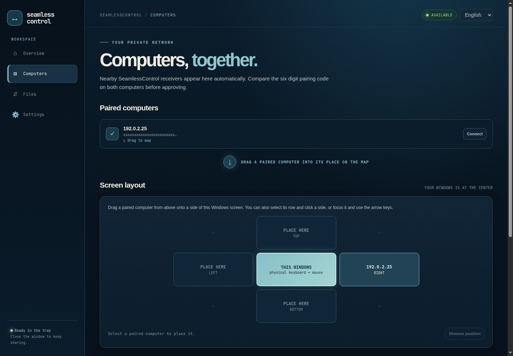

# SeamlessControl en Windows x64

[English](WINDOWS-ALPHA.md) · [Inicio](../README.es.md) · [Guía técnica](TECHNICAL.es.md)

La aplicación Windows usa las mismas identidades de confianza y el mismo protocolo de control que el plugin Omarchy. Puede recibir control desde Omarchy, controlar Omarchy con el ratón y teclado físicos de Windows, sincronizar texto del portapapeles y enviar o recibir archivos aprobados. La ventana puede ocultarse en la bandeja mientras el agente sigue activo.

La imagen del mapa usa una dirección ficticia para la documentación.

## Instalar

1. Abre la [última versión](https://github.com/PuroDelphi/seamlesscontrol/releases/latest), lee sus notas de instalación y descarga en **Assets** **`seamlesscontrol-windows-x64.zip`**. Su archivo `.sha256` contiguo permite comprobar esa única descarga.
2. Extrae el ZIP en una carpeta propia, como Descargas o Documentos. Ya incluye juntos los dos ejecutables. Para verificar la descarga desde PowerShell, ejecuta `Get-FileHash .\seamlesscontrol-windows-x64.zip -Algorithm SHA256` y compara el resultado con `seamlesscontrol-windows-x64.zip.sha256` del mismo release.
3. Haz doble clic en `seamlesscontrol.exe`. **Recibir control** se inicia automáticamente en TCP `47832` y Windows anuncia este equipo a los paneles SeamlessControl cercanos. Si Windows pregunta por acceso a la red, selecciona **Redes privadas**.
4. Cierra la ventana para dejar la aplicación en la bandeja. Pulsa su icono para abrirla de nuevo. **Exit SeamlessControl** en el menú de la bandeja termina las sesiones y cierra la aplicación.

Windows 11 normalmente incluye WebView2. Si falta, instala [Microsoft Edge WebView2 Runtime](https://developer.microsoft.com/en-us/microsoft-edge/webview2/). Los ejecutables se distribuyen actualmente sin firma digital.

## Emparejar una vez

1. Conecta ambos equipos a la misma LAN privada. En el **receptor**, deja activo **Recibir control**. Windows lo inicia al abrir la aplicación; en Omarchy debes pulsar **Recibir control**.
2. En el equipo con el ratón físico, abre **Equipos**. Selecciona el receptor cercano y pulsa **Emparejar**. Si no aparece, escribe su `IP:47832` privada en **Dirección manual**.
3. Compara el **código de seis cifras** en ambos equipos y apruébalo en ambos. En Windows, escribe esas cifras en la aplicación y pulsa **Coinciden · aprobar**. La huella de identidad larga es otro valor; no eliges ni modificas el código.
4. Ahora el equipo figura como emparejado. El descubrimiento solo proporciona la dirección; la identidad y el código siguen autorizando la confianza.

Si otra máquina reutilizó una IP y aparece **PeerKey changed**, comprueba quién posee esa dirección. La identidad anterior queda protegida. La [guía técnica](TECHNICAL.es.md) explica dónde se guardan las claves.

## Omarchy controla Windows

En Omarchy, sitúa Windows en el lado correcto del **Mapa de equipos**. Pulsa **Conectar** en el Windows emparejado y espera a **Listo**. Cruza el **borde exterior** de Omarchy hacia ese lado. El ratón y teclado de Windows responden a Omarchy. Para volver, cruza el borde de entrada en Windows o pulsa **Escape** en el teclado físico de Omarchy. Termina la sesión desde el panel Omarchy al acabar.

## Windows controla Omarchy

En Omarchy, pulsa **Recibir control** y espera a **Disponible**. En la app Windows, abre **Equipos**. Los equipos emparejados aparecen primero, justo encima del **Mapa de pantallas**; una flecha indica cómo llevarlos al mapa. Arrastra la fila de Omarchy a su posición alrededor de **Este Windows**, pulsa su posición tras seleccionar la fila o enfócala y usa una flecha del teclado. Pulsa **Conectar** en su fila: se abre **Inicio** con la dirección y el borde guardado. Pulsa allí **Conectar**. Cuando la actividad indique **Ready to control**, cruza ese borde exterior. Regresa por el borde de entrada en Omarchy o pulsa **Escape** en el teclado físico de Windows. **Detener** finaliza la sesión. El mapa permanece visible mientras este Windows recibe control.

Windows puede recibir o iniciar el control. Al pulsar **Conectar**, la app pausa su receptor para que el teclado físico tenga un solo dueño. Al pulsar **Detener** o perderse la conexión de origen, vuelve a iniciar **Recibir control** automáticamente.

## Portapapeles y archivos

Durante una sesión, copia texto en un equipo y pégalo en el otro. El texto se sincroniza en ambos sentidos; las imágenes y los formatos enriquecidos no forman parte de esta función.

Para recibir un archivo en Windows, abre **Archivos**, elige la carpeta de destino y pulsa **Esperar un archivo**. El emisor debe estar emparejado y enviar a `IP_WINDOWS:47833` desde **Archivos**. Revisa la oferta en Windows y pulsa **Aceptar archivo**. La recepción espera una sola oferta; pulsa **Esperar un archivo** de nuevo para el siguiente. Para enviar desde Windows, inicia **Esperar un archivo** en Omarchy, introduce su `IP:47833` en **Archivos** de Windows, elige el archivo y pulsa **Enviar archivo**. El receptor lo aprueba.

### Copiar en un explorador y pegar en el otro

En **Archivos**, usa la tarjeta superior **Copia aquí, pega allá**. El botón **Esperar un archivo** de abajo pertenece al envío manual por el puerto `47833` y no hace falta para un archivo copiado.

Con ambas aplicaciones abiertas y los equipos emparejados, copia **un archivo local** en el Explorador o en el explorador Omarchy. Si hay un solo par, se ofrece automáticamente; si hay varios, escoge el destino en **Archivos → Copia aquí, pega allá**. El receptor debe permitir TCP `47834` en su LAN privada. Windows muestra un diálogo nativo aunque la app esté en la bandeja; Omarchy muestra una notificación con botones incluso en otro workspace. Acepta o rechaza. Tras la transferencia verificada, abre la carpeta de destino y usa **Pegar**. Este flujo no requiere una sesión de control ni pulsar **Esperar un archivo**. El límite de tamaño de cada equipo se aplica en ambos extremos. Una oferta sin respuesta caduca a los dos minutos. El progreso aparece en la app. Se admite un archivo por vez.

## Firewall y descubrimiento

Usa **Ajustes → Firewall de Windows** si otro equipo no puede acceder a este Windows receptor. **Permitir puerto de control** pide autorización de administrador para TCP entrante en el puerto de control mostrado. **Permitir puerto de archivos** hace lo mismo para el envío manual. **Permitir puerto de archivos copiados 47834** habilita las ofertas de archivos copiados. Si Windows no aparece automáticamente en Omarchy, **Permitir descubrimiento · UDP 5353** permite las consultas mDNS locales. Las reglas quedan limitadas al perfil de red **Privada** y a **LocalSubnet**. Si cambias un puerto TCP, actualiza el campo correspondiente antes de pulsar el botón de firewall. La app informa de que *solicitó* autorización; la consola elevada de Windows informa del resultado. Puedes retirar las reglas `SeamlessControl TCP … Private LAN` y `SeamlessControl UDP 5353 Private LAN` desde Firewall de Windows.

El autodescubrimiento usa mDNS en la LAN privada y no sustituye el emparejamiento. Si el router, el aislamiento Wi-Fi o un filtro multicast ocultan un equipo, escribe su `IP:puerto` privada manualmente. Si el emparejamiento agota el tiempo, comprueba que el receptor esté activo y permita el puerto de control. Los archivos necesitan un puerto distinto permitido en el **receptor** del archivo.

## Actualizar o desinstalar

Para actualizar, selecciona **Exit SeamlessControl** en la bandeja, descarga `seamlesscontrol-windows-x64.zip` de la [última versión](https://github.com/PuroDelphi/seamlesscontrol/releases/latest), extráelo y reemplaza ambos `.exe` en su carpeta y abre la app de nuevo. Los emparejamientos de `%LOCALAPPDATA%\SeamlessControl` se conservan.

Para desinstalar, sal desde la bandeja y borra la carpeta de los ejecutables. `%LOCALAPPDATA%\SeamlessControl` conserva la identidad y los pares por si reinstalas. Borra esa carpeta de datos solo si quieres una identidad nueva; los demás equipos deberán emparejarse otra vez. Retira también las reglas de firewall que hayas autorizado.

Los comandos manuales, el diseño de seguridad y las verificaciones físicas están en la [guía técnica](TECHNICAL.es.md) y el [registro de pruebas](TEST-RESULTS.es.md).
