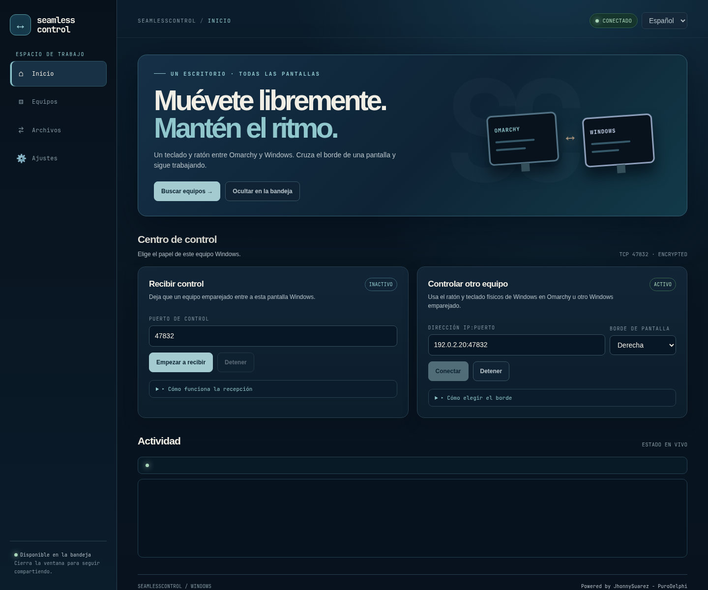
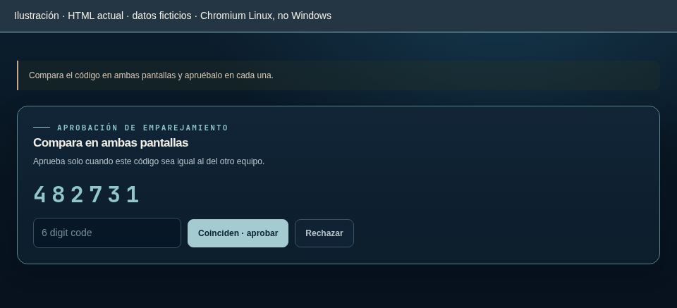
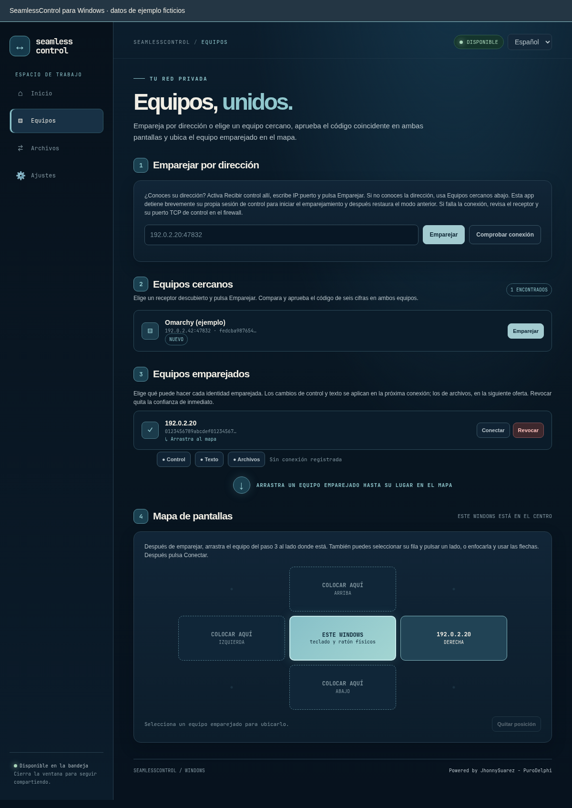
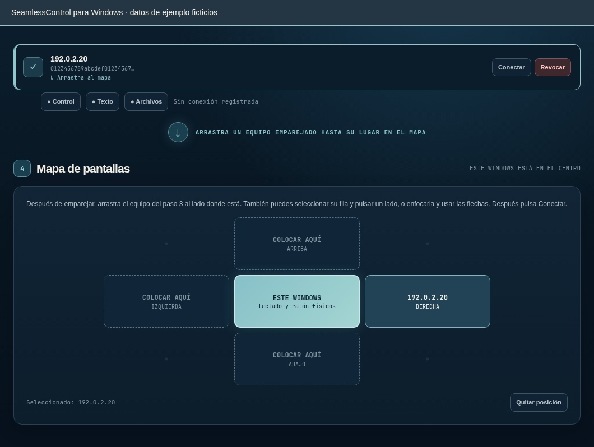
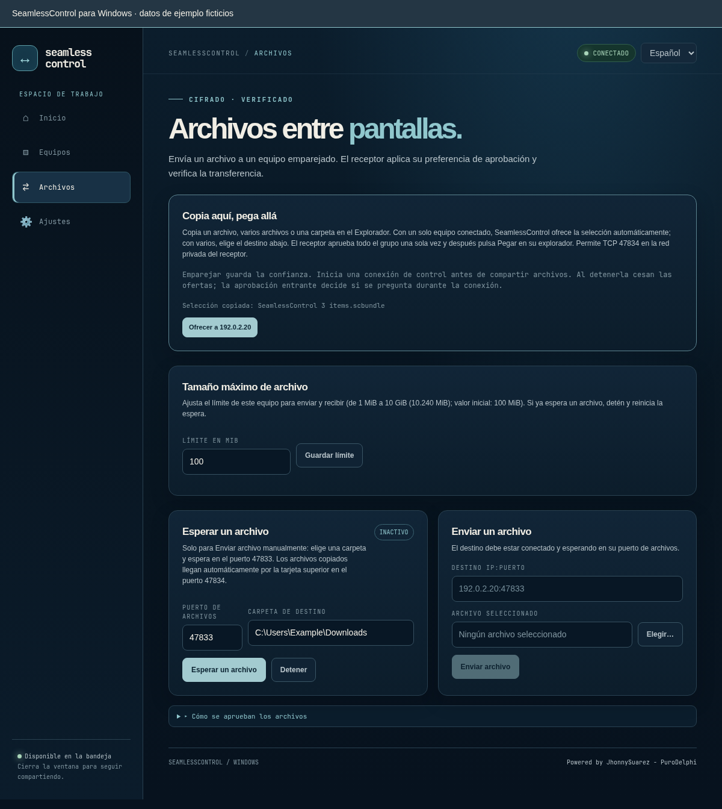
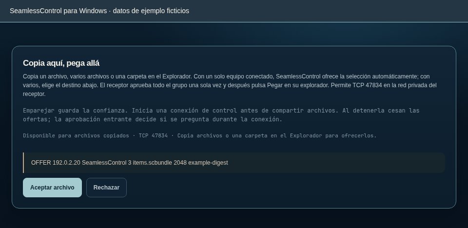
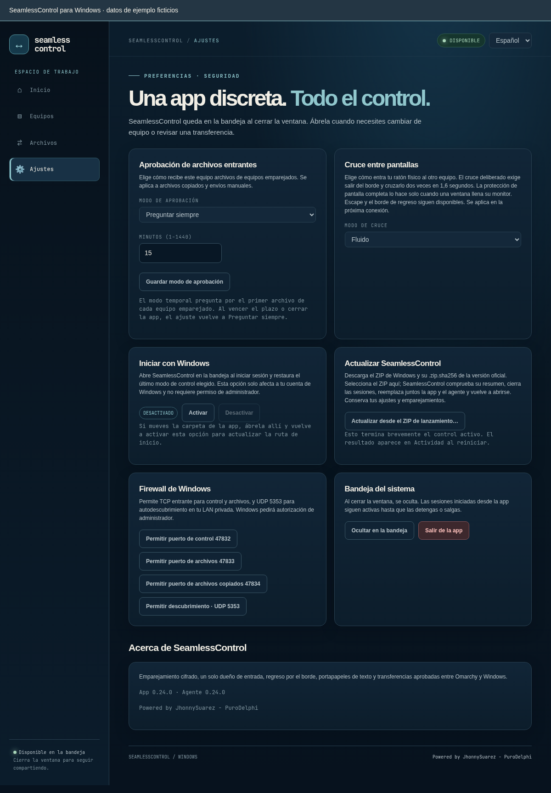

# SeamlessControl en Windows x64

[English](WINDOWS.md) · [Inicio](../README.es.md) · [Guía técnica](TECHNICAL.es.md)

Usa el ratón y teclado de Omarchy en Windows, o el ratón y teclado físicos de Windows en Omarchy. Los equipos emparejados también pueden compartir texto y archivos aprobados. Cerrar la ventana mantiene la app en la bandeja del sistema; **no** detiene el uso compartido.

Esta guía describe la interfaz actual del repositorio. Un release con tag puede ser anterior: sigue sus notas si los botones difieren. El [registro de pruebas](TEST-RESULTS.es.md) distingue observaciones físicas y comprobaciones pendientes; es un historial, no otra guía de instalación.

**Ir a:** [Instalar](#instalar) · [Emparejar](#emparejar-los-equipos-una-vez) · [Recibir control](#recibir-control-en-windows) · [Controlar Omarchy](#controlar-omarchy-desde-windows) · [Volver o detener](#volver-o-detener-el-uso-compartido) · [Texto y archivos](#compartir-texto-y-archivos) · [Firewall](#permitir-solo-los-puertos-lan-necesarios) · [Problemas](#resolver-problemas-habituales) · [Actualizar o desinstalar](#actualizar-o-desinstalar)

> **Sobre las imágenes:** muestran la interfaz real de SeamlessControl para Windows con nombres, códigos, archivos y direcciones ficticios (`192.0.2.x`). No introduzcas las direcciones ni el código de ejemplo. Para regenerarlas, usa `python3 scripts/render-windows-doc-screenshots.py` (requiere Chromium).

## Instalar

### Instalación normal: un release con tag

1. Abre la [última versión](https://github.com/PuroDelphi/seamlesscontrol/releases/latest) y lee sus notas.
2. En **Assets**, descarga **`seamlesscontrol-windows-x64.zip`**, no el ZIP del código fuente de GitHub. Para comprobar opcionalmente la integridad, descarga su archivo contiguo `seamlesscontrol-windows-x64.zip.sha256`, ejecuta `Get-FileHash .\seamlesscontrol-windows-x64.zip -Algorithm SHA256` en PowerShell y compara el hash.
3. Extrae el ZIP en una carpeta que vayas a conservar, por ejemplo dentro de Documentos. **`seamlesscontrol.exe` y `seamlesscontrold.exe` deben permanecer juntos.** No hay un instalador que ejecutar.
4. Haz doble clic en **`seamlesscontrol.exe`** tras extraerlo; no lo abras dentro del ZIP. Continúa con el [primer inicio](#primer-inicio-y-bandeja-del-sistema).

### Primer inicio y bandeja del sistema

1. En una LAN doméstica/laboral de confianza, usa el perfil de red **Privada** de Windows. Si aparece una petición del firewall, permite el acceso en **Redes privadas**, no en redes públicas.
2. En el primer inicio, **Inicio → Recibir control** arranca en TCP `47832`. Estado esperado: **ACTIVO** y **DISPONIBLE** cuando se inicia el receptor. El descubrimiento también puede hacer que este equipo aparezca en Omarchy.
3. Elige **English** o **Español** en el selector superior derecho si lo necesitas.
4. Cerrar la ventana o pulsar **Ocultar en la bandeja** solo la oculta. Pulsa el icono de la bandeja para abrirla. **Ajustes → Salir de la app** o **Exit SeamlessControl** en el menú de la bandeja termina las sesiones de esta app y sale.

Los siguientes inicios restauran el último modo elegido: recibir, conexión saliente o ninguno. Una conexión saliente reintenta si el otro equipo no está disponible; volver a abrir la app no siempre inicia una nueva recepción.

Si el inicio indica que falta WebView2, instala [Microsoft Edge WebView2 Runtime](https://developer.microsoft.com/en-us/microsoft-edge/webview2/). Los ejecutables no tienen firma digital; descárgalos del release o workflow de este proyecto y no desactives globalmente la seguridad de Windows para ejecutarlos.

**Inicio automático opcional:** en **Ajustes → Iniciar con Windows**, pulsa **Activar**. Estado esperado: **ACTIVADO**. Solo afecta a tu cuenta, no requiere autorización de administrador y abre la app en la bandeja al iniciar sesión, restaurando el modo de control. Pulsa **Desactivar** para anularlo. Si mueves la carpeta de la app, ábrela desde la nueva ubicación y pulsa **Activar** otra vez para actualizar la ruta. Un nuevo inicio de sesión sigue figurando como comprobación física pendiente en el registro; la ilustración no demuestra esa prueba.

## Emparejar los equipos una vez

Emparejar establece confianza; **no** inicia la entrada remota. Necesitas acceso a ambas pantallas para aprobar el mismo código de seis cifras.

1. Conecta ambos equipos a la misma LAN privada de confianza. Decide cuál **recibirá** la solicitud. En ese equipo, inicia **Recibir control** y déjalo activo.
2. En Windows, abre **Equipos** y usa **una** de estas alternativas:
   - **2 Equipos cercanos → Emparejar** en el receptor que reconozcas.
   - **1 Emparejar por dirección:** introduce la `IP:puerto` privada real del receptor (normalmente `47832`) y pulsa **Emparejar**. No hace falta autodescubrimiento.
3. Compara las **seis cifras de ambas pantallas**. Si no coinciden o no esperabas la solicitud, pulsa **Rechazar**. En Windows, escribe las cifras mostradas y pulsa **Coinciden · aprobar**; aprueba también en el otro equipo. La huella de identidad larga no es el código de emparejamiento.
4. Resultado esperado: **Equipo emparejado correctamente** y una fila en **3 Equipos emparejados**. Solo después sitúalo en el mapa o conecta.

Si falla el emparejamiento con una dirección escrita manualmente, pulsa **Comprobar conexión**. Distingue un puerto inaccesible de un equipo accesible que aún necesita emparejarse. Un puerto abierto no demuestra la identidad: compara el código de seis cifras.

Cuando Windows inicia **Emparejar**, detiene temporalmente su propia recepción/conexión saliente y restaura el modo anterior al terminar, incluso tras un rechazo. Mantén **Recibir control** activo en el **otro** equipo. Si inicias desde Omarchy, detén su propio receptor con **Detener recepción para emparejar**, envía la solicitud al receptor Windows activo y vuelve a iniciar la recepción en Omarchy si ese es el papel que necesitas. **Cortar entrada remota · emergencia** es una pausa de seguridad en Omarchy, no sustituye detener su receptor.

El descubrimiento aporta una dirección, no permiso para confiar. **CLAVE CAMBIADA** significa que la identidad descubierta difiere de la guardada. Comprueba el equipo real antes de cambiar la confianza; no apruebes una identidad de sustitución inesperada. Para un equipo revocado intencionadamente, inicia una solicitud explícita **Emparejar** y aprueba el nuevo código coincidente en ambos agentes actualizados. Las conexiones normales siguen bloqueadas.

## Recibir control en Windows

Sigue estos pasos cuando tu **teclado y ratón físicos están en Omarchy**.

1. En Windows, pulsa **Inicio → Recibir control → Empezar a recibir** si aún no está activo. Estado esperado: **ACTIVO / DISPONIBLE**. Puedes ocultar la ventana en la bandeja.
2. En Omarchy, coloca el Windows emparejado en el lado correcto del **Mapa de equipos** y pulsa **Conectar**. Espera a **Listo**, no solo a una conexión autenticada.
3. Cruza el **borde exterior** de las pantallas Omarchy hacia Windows. Tu entrada ahora maneja Windows.
4. Vuelve por el borde de entrada de Windows o pulsa **Escape en el teclado físico de Omarchy**. Consulta [Volver o detener](#volver-o-detener-el-uso-compartido) para terminar la conexión y no solo regresar.

Usa el escritorio normal de Windows desbloqueado. La entrada remota no permite operar la pantalla de bloqueo ni el escritorio seguro de UAC; Windows también puede bloquear la inyección en aplicaciones elevadas. Usa el teclado y ratón locales de Windows para esas acciones. No se han verificado físicamente todas las disposiciones de monitores, teclas y distribuciones de teclado.

## Controlar Omarchy desde Windows

Sigue estos pasos cuando tu **teclado y ratón físicos están en Windows**.

1. En Omarchy, pulsa **Recibir control** y espera a **Disponible**.
2. En Windows **Equipos → 3 Equipos emparejados**, arrastra la fila de Omarchy al lado correcto de **ESTE WINDOWS** en **4 Mapa de pantallas**. También puedes seleccionar la fila y pulsar un lado, o enfocarla y pulsar una flecha del teclado. Resultado esperado: su dirección aparece en esa posición del mapa.
3. Pulsa **Conectar en la fila emparejada**. Esto solo abre **Inicio** y rellena destino y borde guardado. **Aún no ha iniciado la conexión.** La fila supone el puerto de control `47832`; corrige la dirección en Inicio si el receptor usa otro puerto.
4. Comprueba **Inicio → Controlar otro equipo → Dirección IP:puerto** y **Borde de pantalla**, y pulsa **Conectar allí**. Ese botón inicia el control y detiene el receptor propio de Windows.
5. Espera a **`Ready to control` en Actividad** y cruza el **borde exterior de las pantallas Windows** elegido, no una separación interna entre monitores locales. Tu entrada ahora maneja Omarchy.

**Ejemplo:** Omarchy está físicamente a la derecha de Windows → colócalo a la derecha → **Borde de pantalla** en Windows es **Derecha** → cruza el borde exterior derecho de Windows. Vuelve por el borde de entrada izquierdo de Omarchy. La sesión directa comunica ese borde de regreso: **no necesitas configurar un mapa inverso en el receptor solo para volver.**

La app recuerda el destino y el borde. Si dejaste habilitado el control saliente, reconecta al abrirse y reintenta mientras el receptor no esté disponible. Un indicador **CONECTADO/ACTIVO** por sí solo no demuestra que la captura de entrada esté lista; mira Actividad antes de cruzar.

**Preferencia de cruce:** En **Ajustes → Cruce entre pantallas**, elige **Fluido** (un cruce), **Deliberado** (sal del borde y crúzalo dos veces en 1,6 segundos) o **Proteger pantalla completa** (dos cruces solo cuando la ventana activa llena su monitor). Se aplica en la siguiente conexión. Escape y el borde de regreso siguen devolviendo el control.

En **Equipos → Equipos emparejados**, cada identidad guardada tiene permisos separados de **Control**, **Texto** y **Archivos**, y muestra la última conexión. Control y texto cambian en la próxima conexión; archivos, en la siguiente oferta. **Revocar** elimina la confianza de inmediato.

## Volver o detener el uso compartido

| Qué quieres | Qué hacer | Resultado esperado |
| --- | --- | --- |
| Volver al equipo con tu ratón físico | Cruza el borde de entrada del receptor o pulsa **Escape en el teclado físico del origen** | La entrada vuelve a ser local; la conexión queda lista para otro cruce. |
| Terminar la conexión saliente de Windows | **Inicio → Controlar otro equipo → Detener** | Termina el control saliente; Windows pasa a **Recibir control**. |
| Dejar de aceptar control remoto en Windows | **Inicio → Recibir control → Detener** | Termina la recepción; el modo guardado queda inactivo. Para detener todo el control tras una conexión saliente, usa ambos botones Detener en ese orden. |
| Detener completamente esta app | **Ajustes → Salir de la app** o **Exit SeamlessControl** en la bandeja | Terminan las sesiones iniciadas por esta app y sale el proceso. |
| Retirar la confianza de un equipo | **Equipos → Equipos emparejados → Revocar → Sí, revocar** | Bloquea su identidad, elimina su posición del mapa y cierra el control afectado. Volver a emparejar exige aprobar un código nuevo en ambos equipos. |

Detener el control termina el intercambio de archivos con ese equipo aunque el receptor de archivos siga abierto. Emparejar por sí solo no permite enviar ni recibir archivos. Cerrar la ventana solo oculta la app en la bandeja; usa **Detener** para terminar la sesión.

## Compartir texto y archivos

### Texto: necesita una conexión de control

Mientras la conexión de control esté en ejecución, copia texto en un equipo y pégalo en el otro. La sincronización es bidireccional; no sincroniza imágenes del portapapeles ni formatos enriquecidos. No necesitas enviar un archivo de texto para compartir su texto.

### Archivos: elige el flujo adecuado

| Tarea | Usa | Qué necesita el receptor |
| --- | --- | --- |
| Copiar en un explorador y pegar en el otro | Tarjeta superior **Archivos → Copia aquí, pega allá** | Conexión de control activa; app/plugin en ejecución; TCP `47834`; sin espera manual. |
| Elegir un archivo y guardarlo directamente en una carpeta | **Archivos → Enviar un archivo / Esperar un archivo** | **Esperar un archivo** activo; TCP `47833` por defecto. |

Ambos flujos requieren emparejamiento y conexión de control activa, siguen la preferencia de aprobación del receptor y verifican la transferencia. El envío manual admite un archivo. La copia entre exploradores admite un archivo local, varios archivos o una carpeta como un solo grupo aprobado; admite **Copiar**, no Cortar/mover entre equipos. Ambos equipos deben tener agentes compatibles con grupos.

**Detener Controlar otro equipo detiene las ofertas y transferencias de archivos con ese equipo.** Emparejar por sí solo no inicia el intercambio. Durante una conexión, **Aceptar automáticamente** omite el aviso; elige **Ajustes → Aprobación de archivos entrantes → Preguntar siempre** para exigir una decisión, o desactiva **Archivos** para ese equipo en **Equipos** para bloquear sus ofertas.

#### Copia aquí, pega allá

1. Mantén ambas apps/plugin en ejecución y conecta los equipos emparejados. Copia **un archivo local, varios archivos o una carpeta** en el Explorador o en el explorador Omarchy.
2. Con exactamente un equipo conectado, se ofrece automáticamente. Con varios, elige el destino en **Archivos → Copia aquí, pega allá**. Resultado esperado: aparece el archivo copiado y llega una oferta al receptor.
3. Con el modo predeterminado, el receptor revisa remitente, nombre y tamaño y pulsa **Aceptar archivo** o **Rechazar**. Windows también muestra un diálogo nativo aunque esté oculto en la bandeja; Omarchy usa una notificación de escritorio con botones. La página Archivos también tiene botones de aprobación.
4. Espera la finalización verificada en **Actividad**. Abre entonces la carpeta donde quieres el archivo y **Pega** en el explorador del receptor. Aceptar prepara el portapapeles local; no pega por ti en la carpeta elegida.

La imagen de la oferta muestra los controles **de la app**, no el diálogo nativo Windows. Una oferta de archivo copiado sin respuesta caduca a los **dos minutos**. Cambiar el archivo copiado cancela su oferta saliente. Permite TCP `47834` en el **receptor**; **Esperar un archivo** en `47833` no pertenece a este flujo.

Para varios archivos o una carpeta, SeamlessControl muestra **una sola oferta** con la cantidad de elementos incluidos y el tamaño total. Acéptala una vez y pega la **carpeta del grupo recibido**, ya verificada, en el explorador de destino. El límite configurado se aplica al grupo completo; se admiten hasta 256 elementos, incluidos los de dentro de carpetas. Se rechazan enlaces simbólicos y archivos virtuales no compatibles.

#### Envío manual: guardar directamente en una carpeta

1. En el receptor, abre **Archivos → Esperar un archivo**, introduce una **carpeta de destino existente** y pulsa **Esperar un archivo**. Resultado esperado: el indicador de espera está activo.
2. En el emisor, abre **Archivos → Enviar un archivo**, introduce la `IP:47833` real del receptor (o su puerto de archivos elegido), escoge el archivo y pulsa **Enviar archivo**.
3. El receptor aprueba la oferta salvo que su modo guardado permita aceptación automática. Espera a que termine: el archivo verificado se guarda en la carpeta receptora. **No hace falta Pegar.**
4. Este receptor espera **una oferta**. Pulsa **Esperar un archivo** de nuevo para otra transferencia, también tras rechazar una oferta.

Para Windows → Omarchy, inicia la espera en Omarchy y envía desde Windows. Para Omarchy → Windows, inicia la espera en Windows y envía desde Omarchy. No uses el puerto de control `47832` como destino de archivos.

### Límites de tamaño y aprobación

En **Archivos → Tamaño máximo de archivo**, el predeterminado es **100 MiB** por equipo. El intervalo permitido es **1–10.240 MiB (10 GiB)**. El archivo debe caber en los límites de **ambos** equipos. Tras guardar un límite nuevo, detén y reinicia una espera manual ya activa.

En **Ajustes → Aprobación de archivos entrantes**, elige y pulsa **Guardar modo de aprobación**:

- **Preguntar siempre** (predeterminado): aprueba cada archivo entrante.
- **Aceptar automáticamente**: los archivos de equipos emparejados no requieren una petición individual. Actívalo solo para pares en los que confías para enviar sin preguntar.
- **Preguntar y aceptar por un tiempo**: elige **1–1.440 minutos**. Aceptar el primer archivo de cada par inicia su permiso temporal. Al vencer el plazo o reiniciar la app, el ajuste vuelve a **Preguntar siempre**.

El permiso temporal pertenece a la identidad autenticada del remitente, no a su dirección IP. Revocar el emparejamiento borra ese permiso; otro equipo emparejado en la misma dirección debe solicitar aprobación para su primer archivo.

Resultado esperado al guardar: **Modo de aprobación guardado.** La preferencia afecta a archivos copiados **y** manuales; la aprobación automática no elimina las comprobaciones de identidad, tamaño o integridad. Más detalle: [guía de aprobación de archivos](USER-GUIDE.es.md#límite-de-tamaño-y-aprobación-entrante).

## Permitir solo los puertos LAN necesarios

Usa **Ajustes → Firewall de Windows** en el Windows **receptor** si el tráfico está bloqueado. Cada acción pide autorización de administrador; que la app diga que **solicitó** autorización no confirma que Windows aplicó la regla. Lee el resultado de la consola elevada.

| Acción | Puerto predeterminado | Para qué sirve |
| --- | --- | --- |
| **Permitir puerto de control** | TCP `47832` | Solicitudes de emparejamiento y control entrante. |
| **Permitir puerto de archivos** | TCP `47833` | **Esperar un archivo** manual. |
| **Permitir puerto de archivos copiados 47834** | TCP `47834` | Ofertas y transferencias de archivos copiados. |
| **Permitir descubrimiento · UDP 5353** | UDP `5353` | Descubrimiento mDNS local. |

Las reglas generadas se limitan al perfil de red **Privada** y a direcciones **LocalSubnet**. Antes de permitir un puerto TCP de control/archivos personalizado, cambia su campo en **Inicio/Archivos**; los botones usan esos valores mostrados. Permitir un puerto no inicia su receptor. El firewall del otro equipo también puede necesitar su propia regla receptora.

No abras estos puertos a Internet, no añadas reenvío en el router ni desactives el firewall. En una red pública/no confiable, no cambies el perfil solo para hacer funcionar el uso compartido. Si el filtrado multicast o el aislamiento de clientes Wi-Fi impiden descubrir equipos, usa la dirección privada real del receptor; escribirla manualmente no evita un bloqueo del tráfico entre equipos. El descubrimiento nunca evita el emparejamiento.

## Resolver problemas habituales

| Síntoma | Siguiente acción |
| --- | --- |
| La app no arranca | Extrae ambos ejecutables en la misma carpeta. Instala WebView2 si el mensaje de inicio lo solicita. Comprueba que descargaste el paquete Windows x64. |
| No aparecen equipos cercanos | Inicia **Recibir control** en el destino; comprueba la LAN privada de ambos y las reglas de descubrimiento. Usa **Emparejar por dirección** si solo falla multicast. |
| No aparece código o el emparejamiento agota el tiempo | Lee el aviso en **Equipos**. Comprueba el receptor de destino, su dirección real y su **puerto TCP de control**, y reintenta Emparejar. Mantén su receptor activo durante todo el proceso. |
| Los códigos difieren / solicitud inesperada / CLAVE CAMBIADA | Rechaza y comprueba localmente la identidad del otro equipo. No apruebes solo para quitar el aviso. |
| Un par revocado no conecta | Es lo esperado. Con ambos agentes actualizados, pulsa explícitamente **Emparejar** y compara/aprueba un código nuevo en las dos pantallas. |
| Conectar en la fila solo abre Inicio | Prepara dirección y borde. Pulsa **Conectar en Inicio** para iniciar la sesión. |
| CONECTADO pero cruzar no hace nada | Espera a **Ready to control** en Actividad. Comprueba que el receptor esté disponible y cruza el borde **exterior** elegido. Vuelve/Detén antes de cambiar el lado. |
| No puedes volver por el borde | Pulsa **Escape en el teclado físico del origen**. Actualiza ambos agentes: las sesiones directas aprenden el borde de entrada/regreso sin mapa receptor. Revisa los errores en Actividad. |
| Copiar un archivo no produce una oferta útil | Primero conecta los equipos emparejados y espera Listo; emparejar o solo Recibir control no activa el intercambio. Copia archivos locales o una carpeta; no uses Cortar, archivos virtuales no compatibles ni enlaces. Comprueba los límites y TCP `47834` en el receptor. Con varios pares conectados, elige destino en la tarjeta superior de Archivos. |
| El archivo copiado aceptado no está en la carpeta deseada | Espera a que termine y **Pega en el explorador del receptor**. Los envíos manuales guardan directamente y no necesitan Pegar. |
| Falla el envío manual aunque funciona el control | Inicia **Esperar un archivo** en destino y permite su puerto de archivos (normalmente `47833`), no solo el de control. |
| La app reconecta al abrirse / no puedes reemplazar archivos | Usa Detener para cambiar el modo guardado; para reemplazar ejecutables, **sal desde la bandeja**, no cierres solo la ventana. |

Si un bloqueo/UAC de Windows o una aplicación elevada impide la entrada, usa los controles locales; el acceso remoto a escritorios protegidos no es una función admitida. El [registro de pruebas](TEST-RESULTS.es.md) incluye comprobaciones físicas satisfactorias de bloqueo, suspensión e interrupción del receptor en ambos sentidos y delimita el alcance de otras disposiciones y casos de archivos. Las ilustraciones HTML no validan esos comportamientos.

## Actualizar o desinstalar

### Actualizar

1. Descarga **`seamlesscontrol-windows-x64.zip`** y **`seamlesscontrol-windows-x64.zip.sha256`** del [último lanzamiento con tag](https://github.com/PuroDelphi/seamlesscontrol/releases/latest) en la misma carpeta.
2. En la app pulsa **Ajustes → Actualizar desde el ZIP de lanzamiento…** y elige el ZIP. La app comprueba su SHA256, cierra sus sesiones, sustituye ambos ejecutables juntos y vuelve a abrirse. El resultado aparece en **Actividad**. Conserva identidad, emparejamientos, preferencias y último modo de control.
3. Revisa **Ajustes → Acerca de SeamlessControl**: las versiones de la app y el agente deben coincidir. Si aparece un fallo, se intenta restaurar los ejecutables anteriores; consulta Actividad antes de reintentar.

Si la actualización desde la app no puede ejecutarse, sal desde la bandeja y cierra cualquier agente de consola iniciado por separado. Extrae el ZIP del lanzamiento con tag y reemplaza manualmente los dos `.exe` juntos. Si moviste la carpeta de la app, actualiza **Iniciar con Windows** desde la nueva ubicación.

Los datos de **`%LOCALAPPDATA%\SeamlessControl`** están separados de los ejecutables. No los borres como paso de una actualización normal.

### Desinstalar

1. Pulsa **Ajustes → Iniciar con Windows → Desactivar** si está habilitado.
2. Sal desde la bandeja y borra la carpeta de los ejecutables.
3. Retira las reglas que autorizaste en el Firewall de Windows; sus nombres generados son **`SeamlessControl TCP <puerto> Private LAN`** y **`SeamlessControl UDP 5353 Private LAN`**.
4. Conserva **`%LOCALAPPDATA%\SeamlessControl`** si quieres la misma identidad y pares al reinstalar. Bórrala **solo si quieres eliminar la identidad y ajustes locales**; los demás equipos deberán emparejar la identidad nueva después.

Para usar la consola y conocer la seguridad interna, consulta la [guía técnica](TECHNICAL.es.md). Para observaciones y comprobaciones físicas pendientes, consulta el [registro de pruebas](TEST-RESULTS.es.md).
