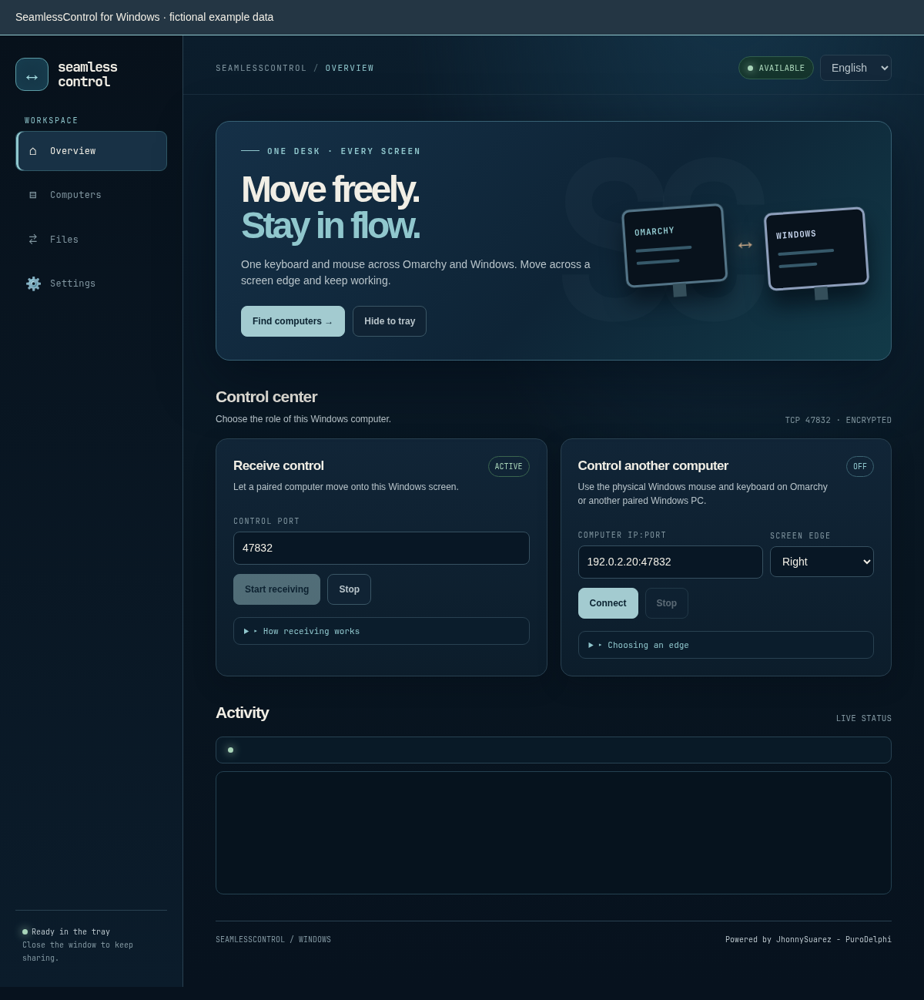
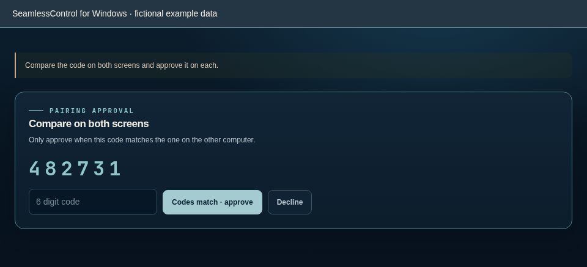
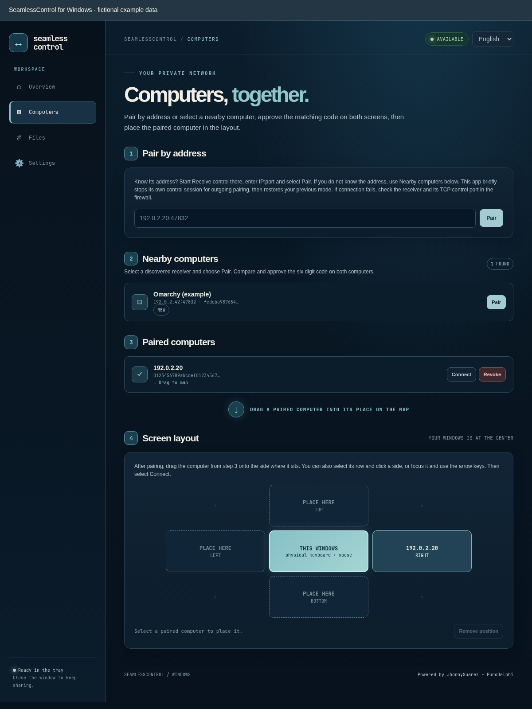
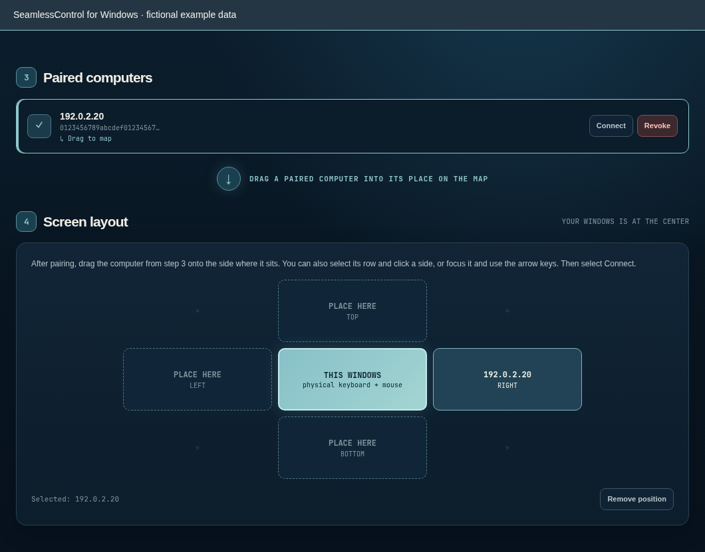
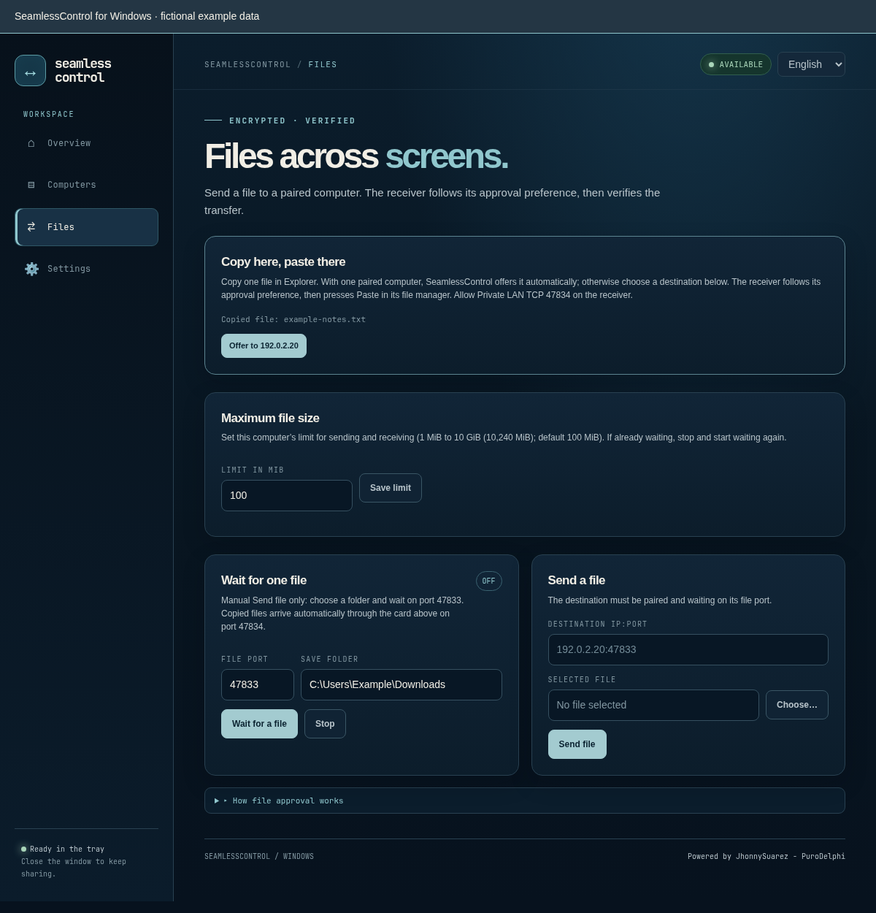
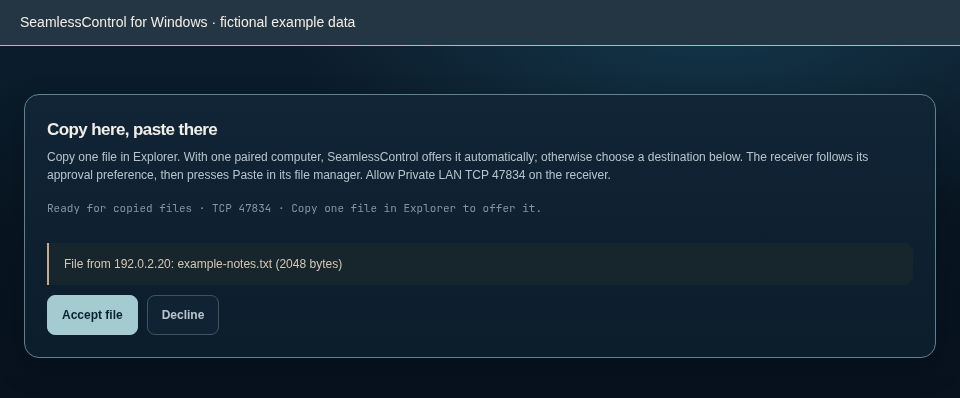
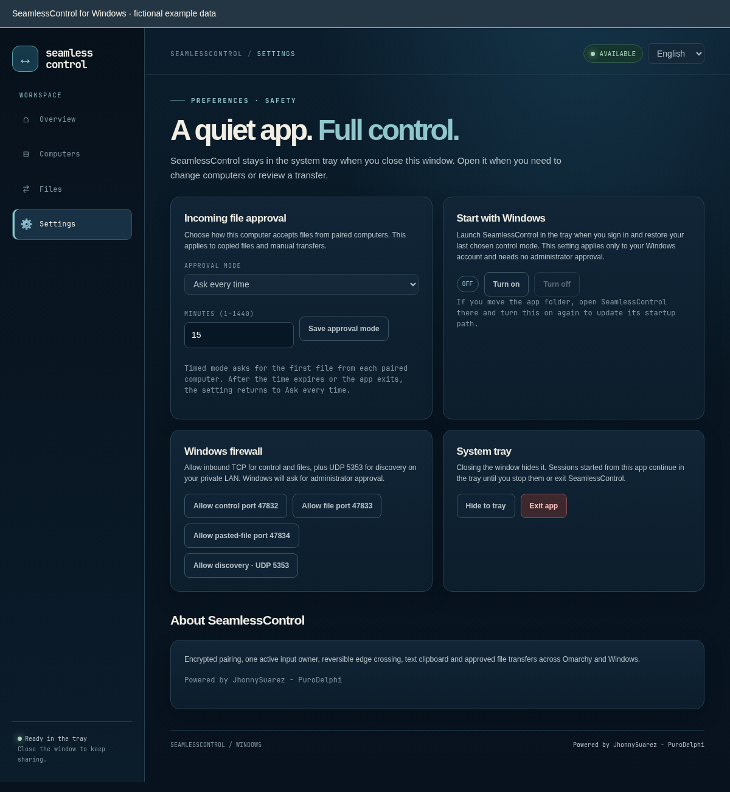

# SeamlessControl on Windows x64

[Español](WINDOWS.es.md) · [Home](../README.md) · [Technical guide](TECHNICAL.md)

Use your Omarchy mouse and keyboard on Windows, or the physical Windows mouse and keyboard on Omarchy. Paired computers can also share text and approved files. Closing the window keeps the app running in the system tray; it does **not** stop sharing.

This guide describes the repository's current interface. A tagged release can be older: follow that release's notes if its buttons differ. The [test record](TEST-RESULTS.md) distinguishes physical observations from pending checks; it is history, not a second installation guide.

**Go to:** [Install](#install) · [Pair](#pair-the-computers-once) · [Receive control](#receive-control-on-windows) · [Control Omarchy](#control-omarchy-from-windows) · [Return or stop](#return-or-stop-sharing) · [Text and files](#share-text-and-files) · [Firewall](#allow-only-the-needed-lan-ports) · [Problems](#solve-common-problems) · [Update or remove](#update-or-remove)

> **About the images:** they show the real SeamlessControl Windows interface with fictional names, codes, files and addresses (`192.0.2.x`). Do not enter the example addresses or pairing code. To regenerate them, use `python3 scripts/render-windows-doc-screenshots.py` (requires Chromium).

## Install

### Normal installation: a tagged release

1. Open the [latest release](https://github.com/PuroDelphi/seamlesscontrol/releases/latest) and read its notes.
2. Under **Assets**, download **`seamlesscontrol-windows-x64.zip`**, not GitHub's source-code ZIP. For an optional integrity check, download its adjacent `seamlesscontrol-windows-x64.zip.sha256`, run `Get-FileHash .\seamlesscontrol-windows-x64.zip -Algorithm SHA256` in PowerShell and compare the hash.
3. Extract the ZIP into a folder you will keep, such as a folder inside Documents. **`seamlesscontrol.exe` and `seamlesscontrold.exe` must stay together.** There is no installer to run.
4. Double-click **`seamlesscontrol.exe`** after extraction; do not launch it inside the ZIP. Continue with [first launch](#first-launch-and-the-system-tray).

### Testing the current alpha

Use this route only when you want the development build rather than a tagged release.

1. Open [Actions → Windows x64](https://github.com/PuroDelphi/seamlesscontrol/actions/workflows/windows-alpha.yml). Sign in to GitHub if artifact downloading requires it.
2. Choose a **successful run for the `alpha` branch** and check its commit. The same workflow also builds `main`; do not assume every run is alpha.
3. Download the **`seamlesscontrol-windows-x64`** artifact. GitHub supplies one ZIP containing both executables and **`SHA256SUMS.txt`**.
4. Extract it and keep the executables together. The optional SHA-256 check is for **each extracted `.exe`** against `SHA256SUMS.txt`, not for the artifact ZIP. Open `seamlesscontrol.exe`.

Tagged releases instead publish a checksum for the **complete ZIP** as a separate asset. Do not mix executables from different builds. For an existing installation, use [Update](#update-or-remove) so the old app is not still running.

### First launch and the system tray

1. On a trusted home/work LAN, use Windows' **Private** network profile. If a firewall prompt appears, allow access on **Private networks**, not Public networks.
2. On the first launch, **Overview → Receive control** starts on TCP `47832`. Expected state: **ACTIVE** and **AVAILABLE** once the receiver starts. Nearby discovery may also make this computer appear in Omarchy.
3. Choose **English** or **Español** in the top-right selector if needed.
4. Closing the window or choosing **Hide to tray** only hides it. Click the tray icon to reopen it. **Settings → Exit app** or **Exit SeamlessControl** in the tray menu ends this app's sessions and exits.

Later launches restore the last chosen control mode: receive, outgoing connection, or neither. An outgoing connection retries if the other computer is unavailable; reopening is not always a fresh receiving session.

If startup reports a missing WebView2 runtime, install [Microsoft Edge WebView2 Runtime](https://developer.microsoft.com/en-us/microsoft-edge/webview2/). These executables are unsigned; download them from this project's release or workflow, and do not disable Windows security globally to run them.

**Optional automatic launch:** in **Settings → Start with Windows**, choose **Turn on**. Expected state: **ON**. It applies only to your Windows account, needs no administrator approval and starts in the tray at sign-in, restoring your control mode. Choose **Turn off** to undo it. After moving the app folder, open it from the new location and choose **Turn on** again to update the path. A new sign-in is still listed as a pending physical check in the test record; the illustration is not evidence of that check.

## Pair the computers once

Pairing establishes trust; it does **not** start remote input. You need access to both screens to approve the same six-digit code.

1. Put both computers on the same trusted private LAN. Decide which computer will **receive** the pairing request. On that computer, start **Receive control** and leave it active.
2. On Windows, open **Computers** and use **one** of these alternatives:
   - **2 Nearby computers → Pair** on the receiver you recognize.
   - **1 Pair by address:** enter the receiver's real private `IP:port` (normally `47832`) and choose **Pair**. Discovery is not required.
3. Compare the **six digits on both screens**. If they differ, or the request is unexpected, choose **Decline**. In Windows, type the displayed digits and choose **Codes match · approve**; approve on the other computer too. The long identity fingerprint is not the pairing code.
4. Expected result: **Computer paired successfully** and a row in **3 Paired computers**. Only then place it on the map or connect.

When Windows initiates **Pair**, it temporarily stops its own receiving/outgoing control session and restores the previous mode when pairing finishes, including after rejection. Keep **Receive control** active on the **other** computer. If you initiate from Omarchy instead, stop its own receiver with **Stop receiving to pair**, send the request to the active Windows receiver, then start receiving on Omarchy again if that is the role you need. **Cut remote input · emergency** is a safety pause on Omarchy, not a substitute for stopping its receiver.

Discovery supplies an address, not permission to trust it. **KEY CHANGED** means the discovered identity differs from the saved one. Check the actual computer before changing trust; do not approve an unexpected replacement identity. For an intentionally revoked computer, use a fresh explicit **Pair** request and approve the new matching code on both updated agents. Ordinary connection attempts remain blocked.

## Receive control on Windows

Use these steps when your **physical keyboard and mouse are on Omarchy**.

1. In Windows, choose **Overview → Receive control → Start receiving** if not already active. Expected state: **ACTIVE / AVAILABLE**. You may hide the window in the tray.
2. In Omarchy, place the paired Windows computer on the correct side of its **Computer layout** and choose **Connect**. Wait for **Ready**, not merely an authenticated connection.
3. Cross the **outer edge** of the Omarchy displays toward Windows. Your input now operates Windows.
4. Return across Windows' entry edge, or press **Escape on the physical Omarchy keyboard**. See [Return or stop](#return-or-stop-sharing) to end the connection rather than just return.

Use the normal unlocked Windows desktop. Remote input is not a way to operate the lock screen or secure UAC desktop; Windows may also block injection into elevated applications. Use the local Windows keyboard and mouse for those actions. Other monitor arrangements, keys and layouts are not all physically verified.

## Control Omarchy from Windows

Use these steps when your **physical keyboard and mouse are on Windows**.

1. In Omarchy, choose **Receive control** and wait for **Available**.
2. In Windows **Computers → 3 Paired computers**, drag the Omarchy row to the correct side of **THIS WINDOWS** in **4 Screen layout**. Alternatively select its row and click a side, or focus the row and press an arrow key. Expected result: its address appears in that map position.
3. Choose **Connect on the paired row**. This only opens **Overview** and fills the destination and saved edge. **It has not started the connection.** The row assumes control port `47832`; correct the address in Overview if the receiver uses another port.
4. Check **Overview → Control another computer → Computer IP:port** and **Screen edge**, then choose **Connect there**. This is the button that starts control and stops Windows' own receiver.
5. Wait for **`Ready to control` in Activity**, then cross the selected **outer edge of the Windows displays**, not an internal boundary between local monitors. Input now operates Omarchy.

**Example:** Omarchy is physically to Windows' right → place it on the right → the Windows **Screen edge** is **Right** → cross Windows' right outer edge. Return via Omarchy's left entry edge. The direct session supplies this return edge: **you do not need to configure an inverse map on the receiver just to return.**

The app remembers the destination and edge. If outgoing control was left enabled, it reconnects on the next launch and retries while the receiver is unavailable. A **CONNECTED/ACTIVE** badge alone is not proof that input capture is ready; use the Activity message before crossing.

## Return or stop sharing

| What you want | What to do | Expected result |
| --- | --- | --- |
| Return to the computer with your physical mouse | Cross the receiver's entry edge, or press **Escape on the physical source keyboard** | Input is local again; the connection stays ready for another crossing. |
| End Windows' outgoing connection | **Overview → Control another computer → Stop** | Outgoing control ends; Windows switches to **Receive control**. |
| Stop accepting remote control in Windows | **Overview → Receive control → Stop** | Receiving ends; the saved control mode is idle. To stop all control after outgoing control, use both Stop actions in that order. |
| Stop this app completely | **Settings → Exit app** or tray **Exit SeamlessControl** | Sessions started by this app end; the process exits. |
| Remove a computer's trust | **Computers → Paired computers → Revoke → Yes, revoke** | Its identity is blocked, its map position is removed and affected control is closed. Re-pairing needs a new code approved on both computers. |

Stopping control alone does **not** turn off copied-file receiving while the app remains open. Exit the app if you want to stop both control and file sharing. Closing its window is never an emergency stop.

## Share text and files

### Text: a control connection is needed

While the control connection is running, copy text on one computer and paste it on the other. Text synchronization is bidirectional; clipboard images and rich formats are not synchronized. You do not need to send a text file to share its text.

### Files: choose the right workflow

| Task | Use | Needed on the receiver |
| --- | --- | --- |
| Copy in one file manager and paste in the other | Top **Files → Copy here, paste there** card | App/plugin running; TCP `47834`; no manual waiting or control connection. |
| Choose a file and save it directly into a folder | **Files → Send a file / Wait for one file** | **Wait for a file** active; TCP `47833` by default. |

Both workflows require pairing, follow the receiving computer's approval preference, and verify the transfer. Use **one file**, not a directory or selection of multiple files. Copied-file sharing supports **Copy**, not cross-computer Cut/move.

#### Copy here, paste there

1. Keep both apps/plugin running and the computers paired. Copy **one local file** in Explorer or the Omarchy file manager.
2. With exactly one paired computer, the file is offered automatically. With several, choose the destination under **Files → Copy here, paste there**. Expected result: the copied file is shown and an offer reaches the receiver.
3. With the default approval mode, the receiver checks sender, filename and size, then chooses **Accept file** or **Decline**. Windows also shows a native approval dialog even when hidden in the tray; Omarchy uses an actionable desktop notification. The Files page has approval buttons too.
4. Wait for verified completion in **Activity**. Then open the folder where you want the file and **Paste** in the receiver's file manager. Accepting prepares the local clipboard; it does not paste into your chosen folder for you.

The offer image shows the **in-app** controls, not the native Windows dialog. An unanswered copied-file offer expires after **two minutes**. Changing the copied file cancels its outgoing offer. Allow TCP `47834` on the **receiver**; **Wait for a file** on `47833` is unrelated to this flow.

#### Manual send: save directly into a folder

1. On the receiver, open **Files → Wait for one file**, enter an **existing destination folder**, and choose **Wait for a file**. Expected result: the waiting badge is active.
2. On the sender, open **Files → Send a file**, enter the receiver's real `IP:47833` (or its chosen file port), choose the file and select **Send file**.
3. The receiver approves the offer unless its saved mode permits automatic acceptance. Wait for completion; the verified file is saved in the receiving folder. **No Paste is needed.**
4. This receiver waits for **one offer**. Choose **Wait for a file** again for another transfer, including after a declined offer.

For Windows → Omarchy, start waiting on Omarchy and send from Windows. For Omarchy → Windows, start waiting on Windows and send from Omarchy. Do not use the control port `47832` as the file destination.

### Size limits and approval

In **Files → Maximum file size**, the default is **100 MiB** per computer. The allowed range is **1–10,240 MiB (10 GiB)**. The file must fit **both** computers' limits. After saving a new limit, stop and restart an already active manual wait.

In **Settings → Incoming file approval**, choose and **Save approval mode**:

- **Ask every time** (default): approve each incoming file.
- **Accept automatically**: files from paired computers need no individual prompt. Enable only for peers you trust to send files without asking.
- **Ask, then accept for a while**: choose **1–1,440 minutes**. Accepting the first file from each paired computer starts its temporary permission. Expiry or an app restart returns the setting to **Ask every time**.

Expected result after saving: **File approval mode saved.** The preference applies to **both** copied and manual files; automatic approval does not remove identity, size or integrity checks. More detail: [file approval guide](USER-GUIDE.md#size-limit-and-incoming-approval).

## Allow only the needed LAN ports

Use **Settings → Windows firewall** on the Windows **receiver** when traffic is blocked. Each action requests Windows administrator approval; the app saying it **requested** approval does not confirm that Windows applied the rule. Read the elevated console's result.

| Action | Default port | Purpose |
| --- | --- | --- |
| **Allow control port** | TCP `47832` | Pairing requests and incoming control. |
| **Allow file port** | TCP `47833` | Manual **Wait for a file**. |
| **Allow pasted-file port 47834** | TCP `47834` | Copied-file offers and transfers. |
| **Allow discovery · UDP 5353** | UDP `5353` | Local mDNS discovery. |

Generated rules are restricted to the **Private** network profile and **LocalSubnet** addresses. Before allowing a custom control/file TCP port, set the matching field in **Overview/Files**; firewall buttons use those displayed values. Allowing a port does not start its receiver. The other computer's firewall may also need its own receiver rule.

Do not open these ports to the Internet, add router forwarding or disable the firewall. On a public/untrusted network, do not change the network profile just to make sharing work. If discovery is blocked by multicast filtering or Wi-Fi client isolation, use the receiver's real private address; manual entry cannot bypass blocked peer-to-peer traffic. Discovery never bypasses pairing.

## Solve common problems

| Symptom | Next action |
| --- | --- |
| App will not start | Extract both executables into the same folder. Install WebView2 if the startup message requests it. Check that you downloaded the Windows x64 package. |
| No nearby computers | Start **Receive control** on the destination; check both computers' private LAN and discovery rules. Use **Pair by address** if only multicast is unavailable. |
| Pairing shows no code or times out | Read the feedback in **Computers**. Check the destination's receiver, real address and **control TCP port**, then retry Pair. Keep its receiver active throughout. |
| Codes differ / unexpected request / KEY CHANGED | Decline and check the other computer's identity locally. Do not approve merely to dismiss the warning. |
| Revoked peer cannot connect | This is expected. With both agents updated, explicitly **Pair** again and compare/approve a fresh code on both screens. |
| Row Connect only opens Overview | This prepares the address and edge. Choose **Connect in Overview** to start the session. |
| CONNECTED but crossing does nothing | Wait for **Ready to control** in Activity. Check that the receiver is available and that you cross the selected **outer** edge. Return/Stop before changing the side. |
| Cannot return by the screen edge | Press **Escape on the physical source keyboard**. Update both agents; direct sessions learn the entry/return edge without a receiver map. See Activity for errors. |
| Copying a file produces no usable offer | Copy one local file, not Cut or a folder. Check pairing, size limits and TCP `47834` on the receiver. With several peers, choose the destination in the top Files card. |
| Accepted copied file is not in the desired folder | Wait for completion, then **Paste in the receiver's file manager**. Manual transfers instead save directly and do not need Paste. |
| Manual sending fails although control works | Start **Wait for a file** on the destination and permit its file port (normally `47833`), not just the control port. |
| App reconnects after reopening / cannot replace files | Use Stop to change the saved mode; to replace binaries, **exit from the tray**, not just close the window. |

If a Windows lock/UAC prompt or an elevated application blocks input, use the local controls; do not treat remote access to protected desktops as supported. The [test record](TEST-RESULTS.md) lists pending physical checks, including other keys/layouts, monitor arrangements, lock/sleep/network loss and some file-transfer cases. HTML illustrations do not validate those behaviors.

## Update or remove

### Update

1. Choose **Exit SeamlessControl** from the tray (or **Settings → Exit app**). Close any separately started console agent too.
2. Download the desired **tagged release** or **successful alpha artifact**, following the matching installation route above.
3. Extract it and replace **both `.exe` files together** in your app folder. Open `seamlesscontrol.exe` again. Expected result: the saved control mode and local pairing data are retained.
4. If you moved the app folder, update **Start with Windows** from its new location.

The data in **`%LOCALAPPDATA%\SeamlessControl`** is separate from the executables. Do not delete it as an ordinary update step.

### Remove

1. Choose **Settings → Start with Windows → Turn off** if enabled.
2. Exit from the tray, then delete the folder containing the executables.
3. Remove the firewall rules you authorized in Windows Firewall; the generated names are **`SeamlessControl TCP <port> Private LAN`** and **`SeamlessControl UDP 5353 Private LAN`**.
4. Keep **`%LOCALAPPDATA%\SeamlessControl`** if you want the same identity and pairings on reinstall. Delete it **only if you want to erase local identity and settings**; other computers must pair with the new identity afterward.

For console operation and security internals, see the [technical guide](TECHNICAL.md). For observations and outstanding physical checks, see the [test record](TEST-RESULTS.md).
